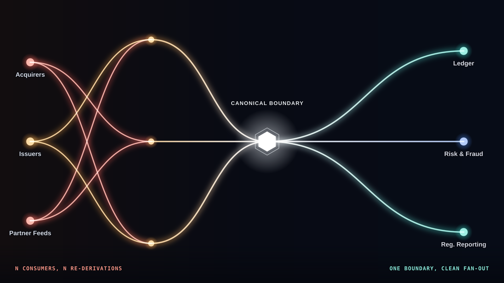
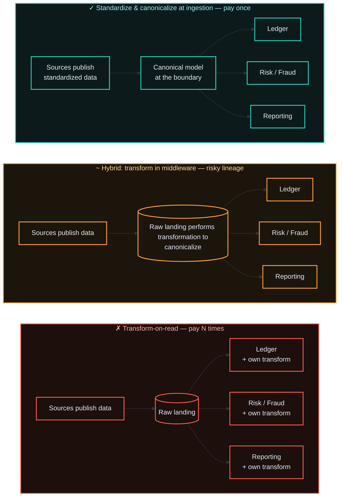

# ADR-001 — Standardize and canonicalize at ingestion vs. transform-on-read downstream

> Reconcile data **once, at the ingestion boundary — shift it to left.** Standardize structure, values and
> canonicalize the model at ingestion (and into the source itself, via data contracts, where you own
> it), instead of landing raw and letting every consumer transform-on-read. Per-consumer reshaping is
> a lineage, reconciliation, governance, and audit cost you pay repeatedly for every consumer — forever;
> in a regulated domain, that bill comes due. Standardizing left is near-universal; canonicalizing
> left is the real judgment call — this ADR makes it.

## Context

A data ecosystem ingests data from many sources:
- In Payment Network world, it can be transactions from merchants & acquirers, card data from issuers, and internal & external partner feeds / systems
- In Banking world, it can be customer data from end-users, card data, core banking systems, partner feeds
- In eCommerce world, it can be product information, inventory information, customer profile data, order management, affiliates, etc.
- In Logistics world, it can be freight information, package information from sources, tracking data, etc.

It's a wide list — data originates from everywhere.

This ingested data serves many consumers:
 - In Payment network world, it can be issuers, acquirers, and internal & external systems including, but not limited to, ledgers, risk and fraud decisioning, clearing, regulatory reporting, analytics, etc.
 - In Banking world, it can be payment networks, ledgers, risk and fraud decisioning, clearing, regulatory reporting, analytics, etc.
 - In eCommerce world, it can be order fulfilment systems, affiliates, reporting & customer servicing platforms, etc.
 - In Logistics world, it can be internal & external partners, reporting & analytical ecosystems, etc.

Narrowing the focus to the financial world (Payment Networks and Banking ecosystems) from hereon.

Each source describes the same real-world things (a party, an
account, a payment transaction) differently: different field names, currencies, date formats, status vocabularies, and identifiers.

Someone has to reconcile those different flavours into one consistent meaning. 

The decision is *where*:
- At the boundary, once, as data enters the platform
- Or later, inside each consumer, every time it reads. 

This is the **Canonical Data Model** pattern (Hohpe & Woolf) applied to a data platform rather than a message bus: agree one internal representation, and translate every source into it at the edge.

Two terms get used interchangeably here; keep them distinct, because the distinction is the point.
- **Standardization** is a *value-level* operation — coerce fields to agreed formats and reference data (ISO 8601 dates, ISO 4217 currency codes, controlled status vocabularies). 
- **Canonicalization** is a *model-level* one — map every source's whole schema into a single agreed model. 

Standardization is a step *within* canonicalization, not a synonym for it: you can standardize formats without a shared model, but you cannot have a canonical model without standardized values. 

This ADR is a decision about the **model** — which is why "canonical", not merely "standardized", is the load-bearing word.

The cost of getting this wrong is not abstract, and it is mostly a *rework* cost — precisely the tax a governed canonical layer removes. Redman puts the cost of bad data at **15–25% of revenue** for most organizations; Gartner's widely-cited figure is **~$12.9M per year** for the average large enterprise. Both are dominated by the same thing this ADR targets — downstream reconciliation, re-cleaning, and lost-trust rework paid over again by every consumer — and the raw material really is that poor: one HBR study found only **3%** of companies' data met basic quality standards. 

Fresher surveys say the number is getting worse, not better — Monte Carlo's 2023 survey put revenue affected by bad data at an average **31%**, up from 26% a year earlier. 

And AI has raised the stakes on the same underlying problem: Gartner predicts that **through 2026, 60% of AI projects unsupported by AI-ready data will be abandoned**, while the 2026 Precisely/Drexel study finds **87% of leaders believe their data is AI-ready even as 43% admit data readiness is their biggest obstacle**. 

A model's output quality is capped by the consistency of what it reads — the canonical layer is increasingly the difference between an AI program and an abandoned one.

## Options Considered

The audit test makes the difference concrete. In the case of a payment network or banking institution, as the transaction flows through various stages, it becomes crucial to maintain lineage. And, let's say, a question arises from an auditor: *"what does `settled_amount` mean, and prove it"*. That's where it gets tricky:

| Option | Cost / complexity | Failure modes | When it's the right call |
|--------|-------------------|---------------|--------------------------|
| **A — Standardize and Canonicalize at ingestion** | High upfront: standardize the inputs, model the canonical schema, map every source to it, own schema evolution at one point. | The boundary becomes a bottleneck and a coupling point; a lossy canonical model silently drops a field a future consumer needs. | Multiple consumers, regulated domain, hard lineage/audit/reconciliation obligations, shared reference data that must mean one thing. |
| **B — Hybrid: raw + conformed layer** | Medium: keep an immutable raw zone for replay, canonicalize into a conformed layer that consumers read. | Two layers to operate; the conformed layer can still lag or drift if not owned. | The usual honest answer at scale — raw for replay and audit, canonical for everything downstream. |
| **C — Transform-on-read** | Low upfront: land raw, let consumers interpret. Flexible; consumers ship independently. | Semantics drift across N consumers; reconciliation logic is re-implemented (and diverges) N times; lineage is bespoke per consumer and effectively untraceable; governance must be proven N times. | Low number of consumers, exploratory/analytical use, unknown or fast-changing schema, a raw zone where premature canonicalization would destroy signal. |

The trap in Option C is that its cost is invisible on day one and compounds silently: the second consumer looks cheap, the tenth is a reconciliation project, and no single team ever sees the whole bill.

## Decision

Standardize and Canonicalize at the ingestion boundary (Option A, in practice via the raw-plus-conformed shape of Option B — raw retained for replay and audit, a governed canonical model as the single thing consumers read).

**Push the work left.** The cheapest place to standardize is as far upstream as you can reach.
- Where you own the source, put it *in* the source — via **data contracts**, so producers emit already-standardized, schema-validated values and quality is owned at the moment of creation (the "shift-left" data movement). 
- Where you don't own the source — external card networks, partner feeds — the ingestion boundary is the leftmost point you control, so standardize there. 

Either way the payoff is the same: once values arrive already standardized, canonicalization collapses to a thin *structural* mapping into the agreed model rather than a heavy reshape repeated in every consumer.
Standardizing left is precisely what makes canonicalizing at the boundary cheap. The work canonicalization still owns is structural and semantic — reconciling that one source sends a payment as a single row and another as header-plus-lines — which format standardization alone won't resolve; but that, too, is paid once at the boundary instead of N times downstream.

The decisive factor is not elegance — it is **exposure**:

In a regulated domain like payments or core banking, lineage, reconciliation, and audit are not features you add later — they are obligations. Paying that cost once at a controlled boundary is defensible; paying it N times in N consumers' bespoke transforms is unauditable — you cannot prove to a regulator what a number means when every consumer computes it differently. That bill is not hypothetical: the OCC fined Citibank **$400M in 2020** explicitly for deficiencies in data quality, data governance, and risk-data aggregation — and regulators added another **$136M in 2024** for insufficient progress fixing the same issues. And a decade after BCBS 239 made lineage and risk-data aggregation a formal obligation, only **2 of 31 G-SIBs** are fully compliant (BIS, 2023) — retrofitting lineage onto N bespoke consumer transforms is exactly as hard as this ADR claims.

Scale is what turns this from best practice into necessity. A payment network processing several hundred million transactions a day, integrating with numerous merchants, acquirers, and issuers, and carrying each transaction through Authorization, Reconciliation, Clearing, Settlement, and Disputes before it ever reaches a report, has no room for N divergent interpretations of the same field. Standardizing upfront, and building the reference data and data products that make that standardization reusable, is what keeps operational systems simple, incident volume manageable, and cost from compounding as scale grows.

**Separate the two moves — they don't carry the same risk.** 

- Shifting *standardization* left is near-universal: almost no one is better off landing dirty values and cleaning them per consumer, and data contracts are steadily winning that argument. 

- Shifting *canonicalization* left is the contested move, and the honest one to defend. The *data mesh* argument (Dehghani) pushes back: a single central canonical model can become a bottleneck and a political battleground, and domain-owned data products can serve consumers better. That critique is right for large, federated orgs with strong domain teams — which is why the decision here is *canonicalize at a governed boundary*, not *one monolithic enterprise schema to rule them all*. Canonicalization is a provable contract at the edge, not central ownership of every model. The transform-on-read / ELT camp — land raw, model per use case — is the other real opponent, and it wins when consumers are few and the work is genuinely exploratory.

## Consequences

**What it buys.** 

One place to encode semantics, enforce reference data, and attach lineage.
Reconciliation is centralized and provable. A new consumer inherits correct, governed data instead
of re-deriving it. Audit is answered once, at the boundary, not defended per consumer.

**What it costs — and when it's the wrong call.**

- **Upfront modeling and ongoing ownership.** The canonical model is a standing commitment; an
  unowned canonical layer rots into just another inconsistent copy.
- **A coupling point.** Every source must map to the model; schema evolution is a governed change,
  not a local one. That friction is the price of consistency.
- **Lossy-canonicalization risk.** Over-normalize and you drop a field a future consumer needs —
  which is exactly why raw is retained, not discarded.
- **When it's simply wrong:** few consumers, genuinely exploratory work, or schemas too volatile to
  model yet. Forcing a canonical model there buys governance nobody needs and taxes the speed that
  actually matters. 
  
  _Example_: A dataset that's only needed by one consumer for a specific use case, with no known future extension of the data or capability outside the domain. Such cases warrant evaluating whether to canonicalize at all, or work directly with the raw dataset.

## Status

Draft.
Related: [ADR-004](004-operational-vs-analytical-data-planes.md) (where the canonical data then lives). Reference-data and metadata-management practices that make this enforceable are candidates for the principles set ([[canonicalize-at-the-boundary]]).

## References

- Hohpe & Woolf — [Canonical Data Model pattern](https://www.enterpriseintegrationpatterns.com/patterns/messaging/CanonicalDataModel.html), *Enterprise Integration Patterns*.
- Dehghani — [Data Mesh Principles](https://martinfowler.com/articles/data-mesh-principles.html) (the decentralized counter-argument).
- Gartner — [How to Improve Your Data Quality](https://www.gartner.com/smarterwithgartner/how-to-improve-your-data-quality), *Smarter with Gartner* (2021, on 2020 research) — poor data quality costs the average large enterprise ~$12.9M/yr.
- Redman — [Seizing Opportunity in Data Quality](https://sloanreview.mit.edu/article/seizing-opportunity-in-data-quality/), *MIT Sloan Management Review* (2017) — bad data costs most companies 15–25% of revenue.
- Nagle, Redman & Sammon — [Only 3% of Companies' Data Meets Basic Quality Standards](https://hbr.org/2017/09/only-3-of-companies-data-meets-basic-quality-standards), *Harvard Business Review* (2017) — 47% of new records carry a critical error.
- Redman, citing IBM — [Bad Data Costs the U.S. $3 Trillion Per Year](https://hbr.org/2016/09/bad-data-costs-the-u-s-3-trillion-per-year), *Harvard Business Review* (2016) — IBM's $3.1T/yr U.S. macro estimate.
- Monte Carlo / Wakefield — [State of Data Quality survey](https://montecarlo.ai/blog-data-quality-survey) (2023) — bad data affected an average 31% of revenue, up from 26% in 2022.
- Gartner — [Lack of AI-Ready Data Puts AI Projects at Risk](https://www.gartner.com/en/newsroom/press-releases/2025-02-26-lack-of-ai-ready-data-puts-ai-projects-at-risk) (Feb 2025) — through 2026, 60% of AI projects unsupported by AI-ready data will be abandoned.
- Precisely & Drexel LeBow — [2026 State of Data Integrity and AI Readiness](https://www.precisely.com/resource-center/analystreports/2026-state-of-data-integrity-and-ai-readiness/) (Jan 2026) — 87% of leaders call their data AI-ready; 43% admit data readiness is their biggest obstacle.
- Basel Committee on Banking Supervision — [Progress in adopting the Principles for effective risk data aggregation and risk reporting](https://www.bis.org/bcbs/publ/d559.htm) (Nov 2023) — only 2 of 31 G-SIBs fully compliant with BCBS 239, a decade on.
- OCC — [$400M civil money penalty against Citibank](https://www.occ.gov/news-issuances/news-releases/2020/nr-occ-2020-132.html) (2020) and [$75M follow-on penalty](https://www.occ.gov/news-issuances/news-releases/2024/nr-occ-2024-76.html) (2024, $136M combined with the Fed) — for deficiencies in data quality, data governance, and risk-data aggregation.
- Sanderson — [The Shift Left Data Manifesto](https://dataproducts.substack.com/p/the-shift-left-data-manifesto) and *Data Contracts* (O'Reilly) — standardize/govern at the producer, upstream of consumers.
