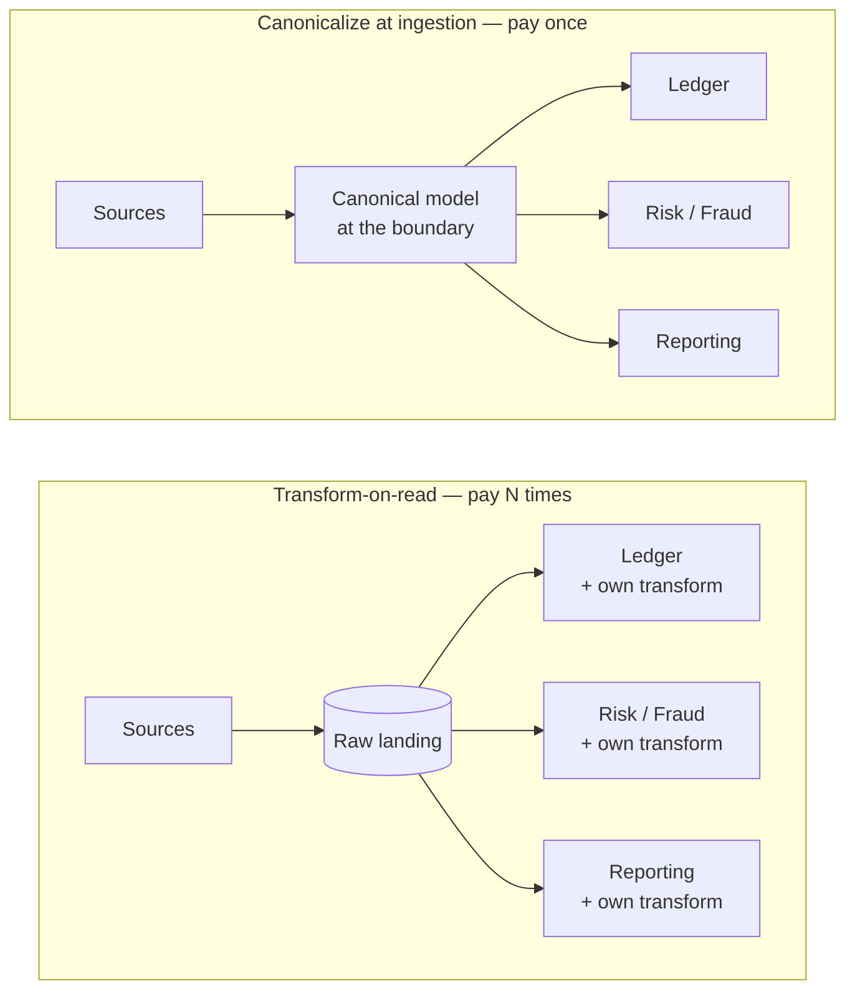
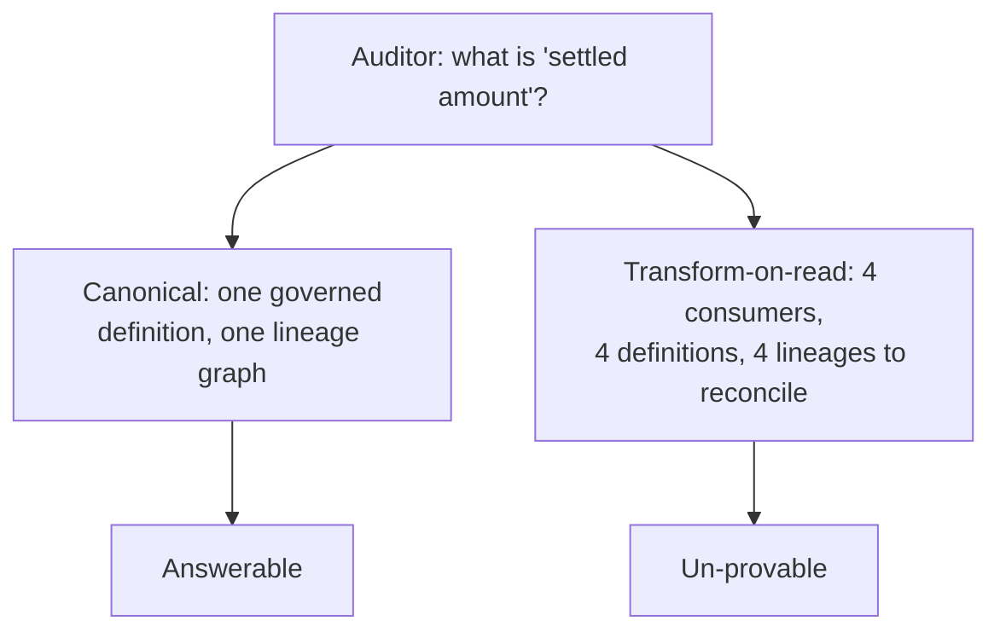

# ADR-001 — Canonical data model at ingestion vs. transform-on-read downstream

> Standardize and canonicalize data **once, at the ingestion boundary**. Letting every
> downstream consumer reshape raw data is a lineage, reconciliation, governance, and audit
> cost you pay again for every consumer — forever. In a regulated domain, that bill comes due.

## Context

A data platform ingests from many sources — [AUTHOR: the real sources, e.g. card networks,
core banking, partner feeds] — and serves many consumers: ledgers, risk and fraud decisioning,
regulatory reporting, analytics. Each source describes the same real-world things (a payment, an
account, a party) differently: different field names, currencies, date formats, status
vocabularies, and identifiers.

Someone has to reconcile those differences into one consistent meaning. The decision is *where*:
at the boundary, once, as data enters the platform — or later, inside each consumer, every time
it reads. This is the **Canonical Data Model** pattern (Hohpe & Woolf) applied to a data platform
rather than a message bus: agree one internal representation, and translate every source into it
at the edge.

The cost of getting this wrong is not abstract. Gartner has put the average cost of poor data
quality at **~$12.9M per year** per organization — most of it the downstream reconciliation,
rework, and lost-trust tax that a governed canonical layer exists to prevent.

[AUTHOR: the specific system and the moment this decision was forced — a new consumer? a failed
reconciliation? an audit finding? Ground the rest of this ADR in that.]

## Options Considered

The audit test makes the difference concrete. Ask *"what does `settled_amount` mean, and prove
it"*:

| Option | Cost / complexity | Failure modes | When it's the right call |
|--------|-------------------|---------------|--------------------------|
| **A — Canonicalize at ingestion** | High upfront: model the canonical schema, map every source to it, own schema evolution at one point. | The boundary becomes a bottleneck and a coupling point; a lossy canonical model silently drops a field a future consumer needs. | Many consumers, regulated domain, hard lineage/audit/reconciliation obligations, shared reference data that must mean one thing. |
| **B — Transform-on-read** | Low upfront: land raw, let consumers interpret. Flexible; consumers ship independently. | Semantics drift across N consumers; reconciliation logic is re-implemented (and diverges) N times; lineage is bespoke per consumer and effectively untraceable; governance must be proven N times. | Few consumers, exploratory/analytical use, unknown or fast-changing schema, a raw zone where premature canonicalization would destroy signal. |
| **C — Hybrid: raw + conformed layer** | Medium: keep an immutable raw zone for replay, canonicalize into a conformed layer that consumers read. | Two layers to operate; the conformed layer can still lag or drift if not owned. | The usual honest answer at scale — raw for replay and audit, canonical for everything downstream. |

The trap in Option B is that its cost is invisible on day one and compounds silently: the second
consumer looks cheap, the tenth is a reconciliation project, and no single team ever sees the
whole bill.

## Decision

Canonicalize at the ingestion boundary (Option A, in practice via the raw-plus-conformed shape of
Option C — raw retained for replay and audit, a governed canonical model as the single thing
consumers read).

The decisive factor is not elegance, it is **exposure**: in [AUTHOR: the regulated domain — e.g.
payments / core banking], lineage, reconciliation, and audit are not features you add later, they
are obligations. Paying that cost once at a controlled boundary is defensible; paying it N times
in N consumers' bespoke transforms is unauditable — you cannot prove to a regulator what a number
means when every consumer computes it differently.

[AUTHOR: the concrete figure that made this real — number of consumers, the reconciliation effort
or incident, the reference-data / metadata-management specifics. This is the load-bearing detail;
do not ship the ADR without it.]

**Where this decision has a real opponent.** The *data mesh* argument (Dehghani) pushes the other
way: a single central canonical model can become a bottleneck and a political battleground, and
domain-owned data products can serve consumers better. That critique is right for large,
federated orgs with strong domain teams — and it is why the decision here is *canonicalize at a
governed boundary*, not *one monolithic enterprise schema to rule them all*. Canonicalization is
about a provable contract at the edge, not central ownership of every model.

## Consequences

**What it buys.** One place to encode semantics, enforce reference data, and attach lineage.
Reconciliation is centralized and provable. A new consumer inherits correct, governed data instead
of re-deriving it. Audit is answered once, at the boundary, not defended per consumer.

**What it costs — and when it's the wrong call.** Real, and worth stating plainly:

- **Upfront modeling and ongoing ownership.** The canonical model is a standing commitment; an
  unowned canonical layer rots into just another inconsistent copy.
- **A coupling point.** Every source must map to the model; schema evolution is a governed change,
  not a local one. That friction is the price of consistency.
- **Lossy-canonicalization risk.** Over-normalize and you drop a field a future consumer needs —
  which is exactly why raw is retained (Option C), not discarded.
- **When it's simply wrong:** few consumers, genuinely exploratory work, or schemas too volatile to
  model yet. Forcing a canonical model there buys governance nobody needs and taxes the speed that
  actually matters. [AUTHOR: a case where you deliberately chose transform-on-read — it proves this
  isn't dogma.]

## Status

draft — awaiting author specifics and review. Related: [ADR-004](004-operational-vs-analytical-data-planes.md)
(where the canonical data then lives). Reference-data and metadata-management practices that make
this enforceable are candidates for the principles set ([[canonicalize-at-the-boundary]]).

## References

- Hohpe & Woolf — [Canonical Data Model pattern](https://www.enterpriseintegrationpatterns.com/patterns/messaging/CanonicalDataModel.html), *Enterprise Integration Patterns*.
- Dehghani — [Data Mesh Principles](https://martinfowler.com/articles/data-mesh-principles.html) (the decentralized counter-argument).
- Gartner — cost of poor data quality (~$12.9M/yr average, 2021 estimate).
