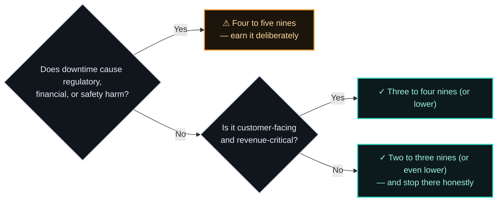
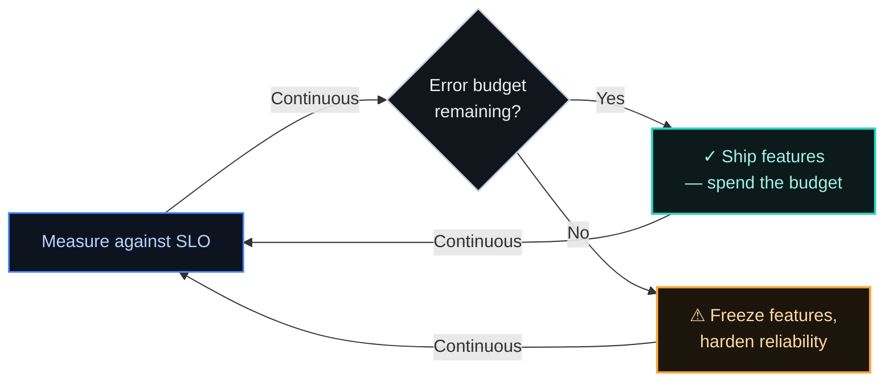

# ADR-002 — Choosing the right availability target (why 99.999% is sometimes wrong)

> Availability is a cost decision, not a trophy. Five nines (~5 min/year) is the right call for the
> critical systems of a payment network, where the regulatory, financial, and trust cost of downtime
> is extreme. For most systems it is the *wrong* call — an honest three or four nines is cheaper,
> simpler, and enough.
> Each nine is an order-of-magnitude harder, while the marginal benefit to users approaches zero.

## Context

On 1 June 2018, a switch component in Visa Europe's primary UK datacentre suffered what the
company called a "very rare" *partial* failure — not a clean break. That distinction is the whole
incident: the backup switch's automatic failover logic was built to react to a clean failure, and
this one wasn't, so it didn't engage. The still-malfunctioning primary kept trying to synchronize
messages with the secondary datacentre throughout, which backlogged the secondary's own capacity
too — the safety net got dragged down with the thing it was supposed to catch. Engineers found and
replaced the part by hand; full service returned after roughly ten hours. 

The bill: 5.2 million failed payments and a Bank of England supervisory action.

![Timeline diagram: Visa Europe's primary UK datacentre suffers a rare partial switch failure on 1 June 2018; because the failure is partial rather than clean, the backup switch's automatic failover does not engage, and the still-failing primary keeps syncing with the secondary datacentre, backlogging its capacity too; engineers intervene manually and restore service after roughly ten hours; the outcome is 10 hours down, 5.2 million failed payments, and a Bank of England supervisory action. Caption: what five nines actually buys is a failover that triggers without a human.](assets/002-visa-outage-anatomy.svg)

That is the whole argument for treating an availability target as an engineering budget rather
than a slogan on a slide. The number on an SLA is meaningless until someone has paid, in advance,
for the failover to actually fire when the rare thing happens — and that payment is only worth
making for systems where the rare thing is unaffordable.

There is constant pressure to commit to a higher availability number anyway, because "more nines"
sounds like "more serious." But an availability target is a combination of:
- Business need: Driven by the needs of the Business (market competence, compliance, regulatory)
- Budget: It dictates redundancy, multi-region topology, automated failover, testing rigor, and on-call load. 

Committing to a number you don't need spends all of that on availability the business would never have paid for if the cost were made explicit.

Google's SRE practice is blunt about this: **100% is the wrong reliability target for essentially
everything.** No user can distinguish 100% from 99.999% — the laptop, home Wi-Fi, ISP, and power
grid in front of your service are collectively far less reliable than five nines, so the last
fraction of a nine is lost in noise the user already experiences. The right target is the one where
the *incremental revenue* from another nine still exceeds its *incremental cost* — and for most
systems that crossover is at three or four nines, not five.

The cost side of that equation is not hypothetical. ITIC's 2024 downtime survey puts the average
hourly cost of downtime above **$300K for over 90%** of mid-size and large enterprises, and **41%**
report $1M–$5M+ per hour — with banking, finance, and payments among the small set of verticals
where the average tops **$5M an hour**. Uptime Institute's 2025 Annual Outage Analysis found
**54%** of significant outages now cost more than $100K, and **one in five** top $1M. Buying a nine
nobody needs is not a rounding error; it's a budget line with a real number on both sides of the
ledger — cost to build it, and cost of the outage it prevents.

For a Payment Network, that processes 100s of millions transactions everyday, with 10s of thousands of them every second - makes it a mission critical system that needs to be available for authorizing each transaction correctly. As each second in the clock counts. And it gets complicated further when regulators expect each transaction to abide by the regulations / rules / compliance across its processing stages (Authorizations, Clearing, Settlement, etc.)
Thus, making mission critical domains within Payment Network a candidate for such high availability and reliability.

## Options Considered

The real question is not "how many nines can you hit" but "how many does *your system* actually
needs." Each nine is a 10× reduction in permitted downtime, and the cost to buy it rises steeply
while the benefit flattens — the curve makes the point faster than the table does:

| Target | Downtime / year | Downtime / month | What it demands | Right for |
|--------|-----------------|------------------|-----------------|-----------|
| 99% (two nines) | 3.65 days | ~7.3 h | Basic monitoring, single region | Internal tools |
| 99.9% (three nines) | 8.77 h | ~43.8 min | Redundancy, tested restore | Most business apps |
| 99.99% (four nines) | 52.6 min | ~4.4 min | Multi-AZ, automated failover, SLOs | Important customer-facing systems |
| **99.999% (five nines)** | **5.26 min** | **~26 s** | Multi-region, sub-minute automated failover, error-budget discipline, heavy game-day testing | **Mission critical paths within Payment networks, regulated core systems** |
| 99.9999% (six nines) | 31.6 s | ~2.6 s | Everything above, at the edge of physics and cost | Very rarely justified |

The decision aid:

## Decision

For mission critical & regulatory driven systems like Authorization domains of Payment Network, commit to **99.999%** — and treat it as a justified decision, not an achievement. 

The math is unforgiving: a payment that can't clear is a regulatory, settlement, and trust event, not an inconvenience. Five nines is where the cost of the next nine finally stops being worth it and the cost of one fewer nine is unacceptable.

The mechanism that made this real was **SLO and error-budget discipline**: an explicit budget of
allowed unreliability, spent deliberately. When the budget is healthy, ship features; when it's
spent, the next work item is reliability, not roadmap. The budget turns a recurring political
argument into arithmetic.

A nuance an honest reliability story must include: speed and stability are **not** opposites. The
2024 DORA research found elite performers deploying on demand *and* running a change-failure rate
around **5%** with recovery under an hour. The 2025 DORA report tightened that bar again — only
**16.7%** of respondents now hit its top-performing band of a **0–2%** change-failure rate, and the
same report finds **AI-assisted delivery** correlating with *more* instability even as it speeds
individual output. The error budget is how you decide *when* the trade is actually forced, not a
standing tax on velocity — and the bar for what counts as disciplined keeps rising, not falling.

## Consequences

**What it buys.** 

Downtime measured in minutes per year and, more importantly, an organization that treats reliability as a budget and business need rather than a hope — every availability decision becomes explicit and defensible.

**What it costs — and when it's the wrong call.**

- **Feature velocity, at the margin**:
  When the budget is spent, five nines means saying NO. That is the trade, stated honestly.

- **Complexity and on-call load**
  Multi-region, automated failover, End-to-End reliability, and game-day testing are a standing operational tax.

- **When it's simply wrong:**
  Most systems. Committing an internal tool or a non-critical service to five nines burns money and engineering time on availability no one would pay for if the price were shown. The skill is knowing where to *stop* adding nines.

## Status

Draft. The resiliency and failover patterns behind this target are demonstrated in running code in the
**[Payments Resiliency Simulator](https://github.com/raghavarora12/payments-resiliency-simulator)**.
Related: [ADR-003](003-multi-region-active-active-vs-active-passive.md) (the multi-region topology
five nines depends on); principles [[availability-is-a-budget]] and [[reliability-is-spent-not-wished]].

## References

- Google SRE — [Embracing Risk](https://sre.google/sre-book/embracing-risk/) (100% is the wrong target; cost vs. marginal utility of each nine).
- Google SRE — [Service Level Objectives](https://sre.google/sre-book/service-level-objectives/).
- DORA — [Accelerate State of DevOps 2024](https://dora.dev/research/2024/dora-report/) (elite: deploy on demand, CFR ~5%, restore < 1h).
- DORA — [2025 State of AI-Assisted Software Development](https://dora.dev/research/publications/) (top-tier band tightened to 0–2% CFR; only 16.7% of respondents hit it; AI adoption correlates with more delivery instability).
- Finextra — [Visa says 5.2m payments failed during 10 hour outage](https://www.finextra.com/newsarticle/32277/visa-says-52m-payments-failed-during-10-hour-outage) (2018).
- Computer Weekly — [Visa reveals 'rare' datacentre switch fault as root cause of June 2018 outage](https://www.computerweekly.com/news/252443325/Visa-reveals-rare-datacentre-switch-fault-as-root-cause-of-June-2018-outage) (2018).
- DataCenter Dynamics — [Visa details cause of widespread outage, blames data center switch failure](https://www.datacenterdynamics.com/en/news/visa-details-cause-of-widespread-outage-blames-data-center-switch-failure/) (2018) — the partial (not clean) failure mode is why the backup switch didn't engage, and why the primary's continued sync attempts backlogged the secondary site too.
- The Register — [Visa fingers 'very rare' data centre switch glitch for payment meltdown](https://www.theregister.com/on-prem/2018/06/19/visa-fingers-very-rare-data-centre-switch-glitch-for-payment-meltdown/497216) (2018).
- Bank of England — [Supervisory action over Visa Europe's June 2018 partial outage incident](https://www.bankofengland.co.uk/news/2019/march/boe-announces-supervisory-action-over-visa-europes-june-2018-partial-outage-incident) (2019).
- ITIC — [2024 Hourly Cost of Downtime Report](https://itic-corp.com/itic-2024-hourly-cost-of-downtime-report/) (>90% of mid/large enterprises: >$300K/hour; 41%: $1M–$5M+/hour; banking/finance among verticals averaging >$5M/hour).
- Uptime Institute — [Annual Outage Analysis 2025](https://uptimeinstitute.com/resources/research-and-reports/annual-outage-analysis-2025) (54% of significant outages cost >$100K; 1 in 5 top $1M).
