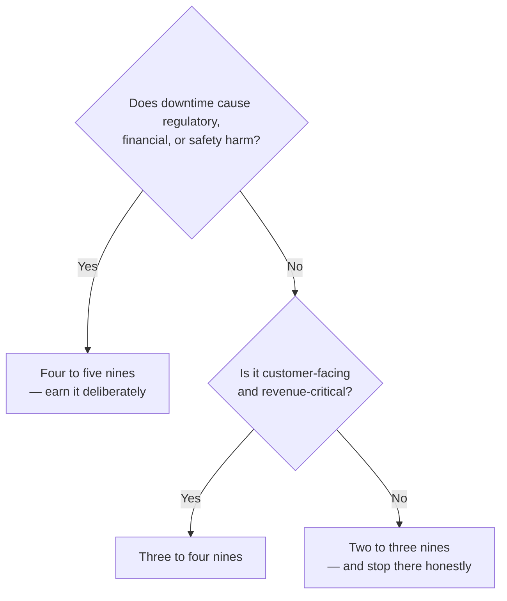
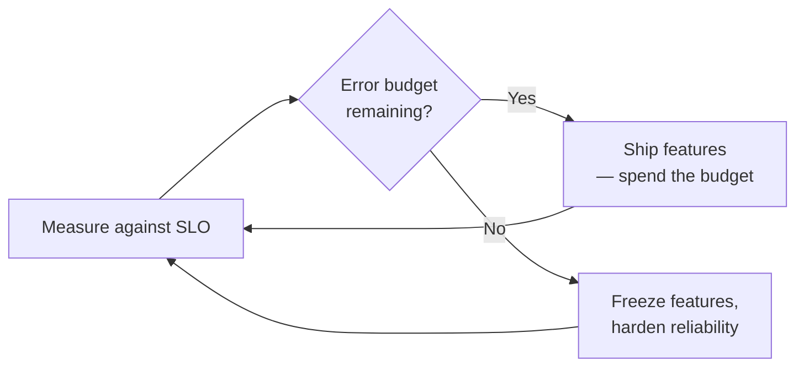

# ADR-002 — Choosing the right availability target (why 99.999% is sometimes wrong)

> Availability is a cost decision, not a trophy. Five nines (~5 min/year) is the right call for a
> payment network, where the regulatory, financial, and trust cost of downtime is extreme. For most
> systems it is the *wrong* call — an honest three or four nines is cheaper, simpler, and enough.
> Each nine is an order-of-magnitude harder, while the marginal benefit to users approaches zero.

## Context

There is constant pressure to commit to a higher availability number, because "more nines" sounds
like "more serious." But an availability target is a budget: it dictates redundancy, multi-region
topology, automated failover, testing rigor, and on-call load. Committing to a number you don't
need spends all of that on availability the business would never have paid for if the cost were
made explicit.

Google's SRE practice is blunt about this: **100% is the wrong reliability target for essentially
everything.** No user can distinguish 100% from 99.999% — the laptop, home Wi-Fi, ISP, and power
grid in front of your service are collectively far less reliable than five nines, so the last
fraction of a nine is lost in noise the user already experiences. The right target is the one where
the *incremental revenue* from another nine still exceeds its *incremental cost* — and for most
systems that crossover is at three or four nines, not five.

[AUTHOR: the real system that ran at 99.999% — which payment network, and the regulatory/financial
context that justified it.]

## Options Considered

The real question is not "how many nines can we hit" but "how many does *this system* actually
need." Each nine is a 10× reduction in permitted downtime, and the cost to buy it rises steeply
while the benefit flattens.

| Target | Downtime / year | Downtime / month | What it demands | Right for |
|--------|-----------------|------------------|-----------------|-----------|
| 99% (two nines) | 3.65 days | ~7.3 h | Basic monitoring, single region | Internal tools |
| 99.9% (three nines) | 8.77 h | ~43.8 min | Redundancy, tested restore | Most business apps |
| 99.99% (four nines) | 52.6 min | ~4.4 min | Multi-AZ, automated failover, SLOs | Important customer-facing systems |
| **99.999% (five nines)** | **5.26 min** | **~26 s** | Multi-region, sub-minute automated failover, error-budget discipline, heavy game-day testing | **Payment networks, regulated core systems** |
| 99.9999% (six nines) | 31.6 s | ~2.6 s | Everything above, at the edge of physics and cost | Very rarely justified |

The decision aid:

## Decision

For [AUTHOR: the payment network], commit to **99.999%** — and treat it as a justified decision,
not an achievement. The math is unforgiving: a payment that can't clear is a regulatory,
settlement, and trust event, not an inconvenience. Five nines is where the cost of the next nine
finally stops being worth it and the cost of one fewer nine is unacceptable.

The mechanism that made this real was **SLO and error-budget discipline**: an explicit budget of
allowed unreliability, spent deliberately. When the budget is healthy, ship features; when it's
spent, the next work item is reliability, not roadmap. The budget turns a recurring political
argument into arithmetic.

A nuance an honest reliability story must include: speed and stability are **not** opposites. The
2024 DORA research finds elite performers deploy on demand *and* run a change-failure rate around
**5%** with recovery under an hour — the error budget is how you decide *when* the trade is
actually forced, not a standing tax on velocity. The lived evidence here is a reduction from
[AUTHOR: 40] to [AUTHOR: <5] monthly incidents over [AUTHOR: timeframe], driven by [AUTHOR: the
specific error-budget / SLO practices you actually ran].

> [AUTHOR: decision needed — if the error-budget mechanism runs long, split it into its own ADR
> (ADR-008). Do not pre-commit to two; only split if there's enough distinct material.]

## Consequences

**What it buys.** Downtime measured in minutes per year and, more importantly, an organization that
treats reliability as a budget rather than a hope — every availability decision becomes explicit
and defensible.

**What it costs — and when it's the wrong call.**

- **Feature velocity, at the margin.** When the budget is spent, five nines means saying no. That is
  the trade, stated honestly. [AUTHOR: a concrete instance where velocity was deliberately traded
  for the budget.]
- **Complexity and on-call load.** Multi-region, automated failover, and game-day testing are a
  standing operational tax.
- **When it's simply wrong:** most systems. Committing an internal tool or a non-critical service to
  five nines burns money and engineering time on availability no one would pay for if the price were
  shown. The skill is knowing where to *stop* adding nines.

## Status

draft — awaiting author specifics and review. The resiliency and failover patterns behind this
target are demonstrated in running code in the
**[Payments Resiliency Simulator](https://github.com/raghavarora12/payments-resiliency-simulator)**.
Related: [ADR-003](003-multi-region-active-active-vs-active-passive.md) (the multi-region topology
five nines depends on); principles [[availability-is-a-budget]] and [[reliability-is-spent-not-wished]].

## References

- Google SRE — [Embracing Risk](https://sre.google/sre-book/embracing-risk/) (100% is the wrong target; cost vs. marginal utility of each nine).
- Google SRE — [Service Level Objectives](https://sre.google/sre-book/service-level-objectives/).
- DORA — [Accelerate State of DevOps 2024](https://dora.dev/research/2024/dora-report/) (elite: deploy on demand, CFR ~5%, restore < 1h).
