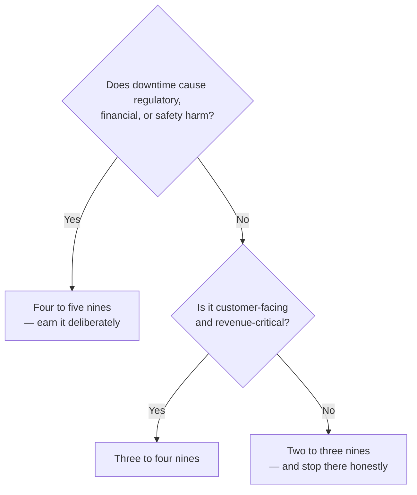

# ADR-002 — Choosing the right availability target (why 99.999% is sometimes wrong)

> Availability is a cost decision, not a trophy. Five nines (~5 min/year) is the right call for a
> payment network, where the regulatory, financial, and trust cost of downtime is extreme. For most
> systems it is the *wrong* call — an honest three or four nines is cheaper, simpler, and enough.
> Each nine is roughly **10× the cost and complexity** of the one before it.

## Context

There is constant pressure to commit to a higher availability number, because "more nines" sounds
like "more serious." But an availability target is a budget: it dictates redundancy, multi-region
topology, automated failover, testing rigor, and on-call load. Committing to a number you don't
need spends all of that on availability the business would never have paid for if the cost were
made explicit.

[AUTHOR: the real system that ran at 99.999% — which payment network, and the regulatory/financial
context that justified it.]

## Options Considered

The real question is not "how many nines can we hit" but "how many does *this system* actually
need." The cost of each nine is roughly an order of magnitude, so the target has to be earned.

| Target | Downtime / year | Downtime / month | What it demands | Right for |
|--------|-----------------|------------------|-----------------|-----------|
| 99% (two nines) | 3.65 days | ~7.2 h | Basic monitoring, single region | Internal tools |
| 99.9% (three nines) | 8.8 h | ~43 min | Redundancy, tested restore | Most business apps |
| 99.99% (four nines) | 52 min | ~4.4 min | Multi-AZ, automated failover, SLOs | Important customer-facing systems |
| **99.999% (five nines)** | **5.3 min** | **~26 s** | Multi-region, sub-minute automated failover, error-budget discipline, heavy game-day testing | **Payment networks, regulated core systems** |
| 99.9999% (six nines) | 32 s | ~2.6 s | Everything above, at the edge of physics and cost | Very rarely justified |

The decision aid:

## Decision

For [AUTHOR: the payment network], commit to **99.999%** — and treat it as a justified decision,
not an achievement. The math is unforgiving: a payment that can't clear is a regulatory,
settlement, and trust event, not an inconvenience. Five nines is where the cost of the next nine
finally stops being worth it and the cost of one fewer nine is unacceptable.

The mechanism that made this real was **SLO and error-budget discipline**: an explicit budget of
allowed unreliability, spent deliberately, with feature velocity traded for reliability when the
budget ran low. The lived evidence is a reduction from [AUTHOR: 40] to [AUTHOR: <5] monthly
incidents over [AUTHOR: timeframe], driven by [AUTHOR: the specific error-budget / SLO practices
you actually ran].

> [AUTHOR: decision needed — if the error-budget mechanism runs long, split it into its own ADR
> (ADR-008). Do not pre-commit to two; only split if there's enough distinct material.]

## Consequences

**What it buys.** Downtime that is measured in minutes per year and, more importantly, an
organization that treats reliability as a budget rather than a hope — every availability decision
becomes explicit and defensible.

**What it costs — and when it's the wrong call.**

- **Feature velocity.** Five nines means saying no to changes that spend error budget you don't
  have. That is the trade, stated honestly. [AUTHOR: a concrete instance where velocity was
  deliberately traded for the budget.]
- **Complexity and on-call load.** Multi-region, automated failover, and game-day testing are a
  standing operational tax.
- **When it's simply wrong:** most systems. Committing an internal tool or a non-critical service
  to five nines burns money and engineering time on availability no one would pay for if the price
  were shown. The skill is knowing where to *stop* adding nines.

## Status

draft — awaiting author specifics and review. The resiliency and failover patterns behind this
target are demonstrated in running code in the
**[Payments Resiliency Simulator](https://github.com/raghavarora12/payments-resiliency-simulator)**.
Related: [ADR-003](003-multi-region-active-active-vs-active-passive.md) (the multi-region topology
five nines depends on).
