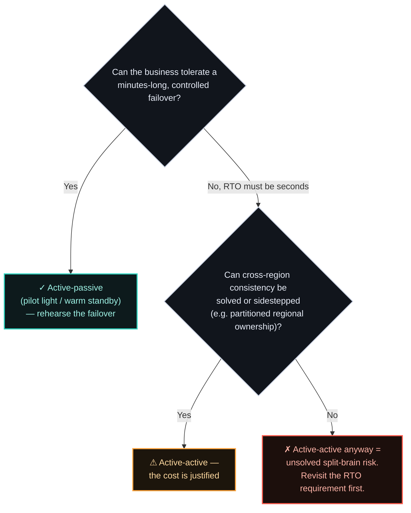

# ADR-003 — Multi-region active-active vs. active-passive

> Active-active is sold as maximum availability, but it protects against a **narrower** set of
> failures than its price implies — and introduces its own. Active-passive with fast, tested
> failover is often the honest choice. Active-active earns its cost only when you need
> near-zero-RTO regional survivability, or you're already multi-region for latency.

## Context

On 21 October 2018, a 43-second loss of connectivity hit the link between GitHub's US East Coast
network hub and its primary US East Coast datacentre. Orchestrator — the system managing MySQL
topology — did exactly what it was built to do: the primary datacentre's node lost quorum, the West
Coast and East Coast public-cloud nodes formed a new one, and writes failed over westward. Automatic failover worked.
That was the problem. When connectivity returned less than a minute later, both coasts held writes
the other didn't have. Rolling back either side meant destroying real, committed user data — so
GitHub's only option was to "fail forward": reconcile the two histories live, in production. The
43-second network blip took **24 hours and 11 minutes** to fully resolve.

![Timeline diagram: on 21 October 2018 a 43-second connectivity loss between GitHub's US East Coast network hub and primary datacentre causes Orchestrator to lose quorum; the West Coast and East Coast public-cloud nodes form a new quorum and fail writes over westward; when connectivity returns, both coasts hold writes the other lacks, so rolling back either side would destroy real user data; GitHub is forced to fail forward instead. The outcome: a 43-second trigger, 24 hours 11 minutes to fully restore service, and a forced fail-forward decision. Caption: what active-active actually costs is a consistency problem on your worst day.](assets/003-github-split-brain-anatomy.svg)

Once a system needs to survive the loss of a whole region, the question is whether both regions
serve traffic at once (active-active) or one serves while the other stands ready (active-passive).
The instinct is that active-active is strictly better because "both are live." GitHub's incident is
the counter-argument in miniature: active-active didn't fail to fail over — it failed over
*correctly*, by design, and that is exactly what produced an unresolvable data conflict. It isn't
strictly better than active-passive — it's a different set of tradeoffs, and the expensive one.

The right frame is a **spectrum of DR strategies**, each with a characteristic RTO (how long to
recover) and RPO (how much data you can lose). AWS's disaster-recovery guidance lays it out cleanly,
and the shape of the tradeoff is the same one ADR-002 makes about nines — cost rises far faster than
the RTO it buys:

| Strategy | Typical RTO | Typical RPO | Steady-state cost | Shape |
|----------|-------------|-------------|-------------------|-------|
| Backup & restore | Hours | Hours | Lowest | Restore from backups after the event |
| Pilot light | 10s of minutes → hours | Minutes | Low | Core data replicated, most infra off |
| Warm standby | Minutes | Seconds | Medium | Scaled-down copy always running |
| **Multi-site active-active** | **Seconds** | **None → seconds** | **Highest** | Both regions serve; reroute on failure |

"Active-passive" in practice means pilot light or warm standby; "active-active" means multi-site / multi-region.

The failure mode you're actually buying protection against matters here too. Uptime
Institute's 2025 Annual Outage Analysis found IT and networking issues now account for **23%** of
impactful outages, and among human-error outages, the share caused by staff not following
established procedures rose **10 percentage points in a single year — from 48% to 58%**. That second
number is the one worth sitting with: the dominant human failure isn't ignorance, it's procedure
under pressure. Every extra region is more topology, more replication paths, and more failover logic
for a human to misconfigure under pressure; the DR strategy you choose has to be judged against the
operational complexity it adds, not just the failure it protects against.

There's a second trap, and it sits one level below the topology choice. When you commit to an
availability target — say 99.999% — that target only holds if **every link in the mission-critical
dependency chain can meet it too**. It isn't enough for your service to be multi-region; everything
it needs in order to *start* has to be multi-region as well.

A concrete example: a workload deployed across `us-east-1` and `us-west-2`, pulling its container
images from a Nexus registry that runs in `us-east-1` only. On paper that is a two-region
architecture. In practice it isn't. If `us-east-1` degrades, `us-west-2` cannot scale out
horizontally, because provisioning new pods means pulling images from a registry that has just gone
down with the region. Unless those images are already cached on the surviving nodes, the standby
region can serve what is already running and nothing more. The dependency chain broke the design
before a single line of application code was involved.

This is why the DR conversation has to walk the whole chain — registries, secret stores, identity
providers, config services, DNS — and not just the application tier. Each one either meets the
target or quietly caps it.

## Options Considered

![Side-by-side topology comparison. Left, active-passive: all traffic goes to Region A, which serves writes and reads; Region B is a warm standby that takes no writes, receives one-way replication, and only takes traffic on failover — RTO in minutes, RPO in seconds, about 1.5× the infrastructure. One writer, so failover is a decision you make and rehearse. Right, active-active: traffic is split across Region C and Region D, both serving writes and reads, with bidirectional replication between them and a conflict surface on that link — RTO in seconds, RPO near none, about 2×+ the infrastructure. Two writers, so consistency is a problem you own permanently. Caption: the second region isn't the cost, the second writer is.](assets/003-active-passive-vs-active-active-topology.svg)

| Option | Cost / complexity | Protects against | Introduces / when right |
|--------|-------------------|------------------|-------------------------|
| **Active-passive** (warm standby) | ~1.5× infra; failover is the hard part to keep tested | Total region loss, with a short, bounded failover gap (RTO minutes, RPO seconds) | Failover that silently rots if never exercised. Right when you need region survivability but can tolerate a minutes-long, controlled cutover. |
| **Active-active** | ~2×+ infra, *plus* the real cost: cross-region data consistency | Total region loss with near-zero RTO; also serves latency from both regions | Split-brain, conflict resolution, and the fact that it **replicates your bad deploy or data corruption to both regions instantly**. Right when zero-RTO regional survivability is mandatory or you're already multi-region for latency. |

Whichever option you land on, the same obligation follows: the failover path has to be **tested,
proven at scale, on a periodic cadence, against scenarios that mimic real production failures**. An
automated failover that has never been exercised is not a capability — it's an assumption. And
assumptions fail on the day you most need them to hold.

The sharp point: most outages are not clean region losses. They are bad deploys, dependency failures, and data corruption — and active-active faithfully propagates all three to every region in milliseconds:

```mermaid
sequenceDiagram
    participant Op as Deploy / bad write
    participant RA as Region A
    participant RB as Region B
    Op->>RA: bad change
    rect rgb(40, 20, 18)
    RA-->>RB: replicate (instantly)
    Note over RA,RB: both regions now broken —<br/>active-active gave you no safe region to fail to
    end
```

This is not a hypothetical. On 12 June 2025, a policy update with an unintended blank field landed in the global Spanner tables behind Google Cloud's Service Control — the authorization layer nearly every Google Cloud service calls on every request. Service Control is deliberately run active in every region for low latency; that same design meant the corrupted policy data propagated globally and crashed Service Control worldwide, taking down IAM, Compute Engine, Cloud Storage, and dozens of dependent services — including Cloudflare, Spotify, and Discord — for close to three hours, and longer in the largest
regions, where the recovery itself created a herd effect on the underlying infrastructure.
The failure mode wasn't a region going dark; it was a bad write, replicated everywhere, instantly, exactly as designed.

In my opinion, a combination of fairly ordinary controls would have contained this — and Google's
own incident report points at the same gaps:

- **Dark, throttled rollout** to a small subset before the change reaches every region
- **Feature-flag protection**, so a new code path can be disabled without a deploy — Google's report notes this code had neither error handling nor a flag
- **Siloed or blue-green deployment**, so no single version ever owns 100% of traffic
- **A proven resiliency test in non-production** that exercises the failure path, not just the happy path, so a local failure can't take the wider estate with it

Active-active buys resilience to the failure mode that is *least* common and asks you to solve cross-region data consistency to get it. Consistency across regions under partition is not a detail you tune later — it is a hard, well-studied problem: the CAP tradeoff, Abadi's PACELC extension (the
latency/consistency tradeoff exists even *without* a partition), and the many correctness bugs Jepsen has found in "globally consistent" stores are all the same evidence from different angles.

The decision aid:

## Decision

There is no single answer that generalises across systems — the business and architectural
justification has to drive it, and in regulated environments compliance obligations often set the
floor before engineering gets a vote. But "it depends" is not a decision, so here is the default I
hold to: **active-passive, unless active-active is specifically earned.**

What earns it:

- Choose **active-active** only when the RTO gap of active-passive is genuinely unacceptable *and*
  you can either solve cross-region data consistency or sidestep it — usually via partitioned
  regional ownership, where every record has a home region that owns its writes.
- Otherwise, **active-passive with an automated failover you actually rehearse** delivers most of
  the protection at a fraction of the cost and complexity.

Rehearsal is not optional flavor — it's the mechanism that makes the RTO in the table real rather than aspirational. AWS's own guidance on **static stability** makes the sharper version of this point: a standby only delivers the RTO you designed for if its capacity is already provisioned and
running *before* the failure, not scaled up reactively during one, when the very dependencies you'd lean on (control planes, autoscalers, provisioning APIs) are the ones most likely to be degraded alongside everything else.

## Consequences

**What it buys.**

- Survival of a region-level failure, at an RTO matched to the target set in
  [ADR-002](002-availability-target.md).
- A recovery path that is bounded and rehearsed, rather than discovered live during the incident.

**What it costs — and when it's the wrong call.**

- **Active-active** makes cross-region data consistency your permanent problem, and its cost is paid every day, not just during a disaster. It is the wrong call when a bounded failover gap is acceptable — which is more often than its reputation suggests.
- **Active-passive** is only as good as the last time you tested automated failover. An untested standby is a false sense of security, not a DR strategy.
- **Both** are the wrong call for systems that don't need to survive region loss at all — single-region with multi-AZ is the honest stop for most services (see [ADR-002](002-availability-target.md)).

## Status

Accepted.

Multi-region failover behaviour is demonstrated in the
**[Payments Resiliency Simulator](https://github.com/raghavarora12/payments-resiliency-simulator)**.
This ADR decides the topology of the data plane; the event log does not inherit that answer, because
its unit of recovery is an offset rather than a row —
[ADR-006](006-multi-region-kafka-high-availability.md) takes that on.
Related: [ADR-002](002-availability-target.md); principle [[design-for-the-common-failure]].

## References

- AWS — [Disaster recovery options in the cloud](https://docs.aws.amazon.com/whitepapers/latest/disaster-recovery-workloads-on-aws/disaster-recovery-options-in-the-cloud.html) (RTO/RPO per strategy).
- AWS Builders' Library — [Static stability using Availability Zones](https://aws.amazon.com/builders-library/static-stability-using-availability-zones/) (Weiss & Furr) — a standby only delivers its designed RTO if capacity is provisioned before the failure, not scaled up during one.
- [Jepsen](https://jepsen.io/analyses) — consistency-testing analyses of distributed databases (why cross-region "consistency" is hard).
- Abadi — [Consistency Tradeoffs in Modern Distributed Database System Design](https://www.cs.umd.edu/~abadi/papers/abadi-pacelc.pdf) (2012) — the PACELC extension to CAP: latency vs. consistency is a live tradeoff even without a partition.
- Google SRE — [Embracing Risk](https://sre.google/sre-book/embracing-risk/) (matching DR spend to the target).
- GitHub — [October 21 post-incident analysis](https://github.blog/news-insights/company-news/oct21-post-incident-analysis/) (2018) — 43-second network partition, Orchestrator quorum failover, 24h11m to reconcile and restore service.
- The Register — [Google caused outage by ignoring its quality protections](https://www.theregister.com/2025/06/16/google_cloud_outage_incident_report/) (2025) — the 12 June 2025 global Service Control outage from a corrupted policy replicated via global Spanner.
- ThousandEyes — [Google Cloud Outage Analysis: June 12, 2025](https://www.thousandeyes.com/blog/google-cloud-outage-analysis-june-12-2025) — regional propagation and recovery timeline.
- Cloudflare — [Cloudflare service outage June 12, 2025](https://blog.cloudflare.com/cloudflare-service-outage-june-12-2025/) — Workers KV's dependency on a third-party cloud provider (which Cloudflare does not name, but which press coverage attributes to GCP) turned Google's outage into a 2h28m Cloudflare outage too; the downstream-blast-radius evidence for why "active everywhere" propagates failure everywhere.
- Uptime Institute — [Annual Outage Analysis 2025](https://uptimeinstitute.com/resources/research-and-reports/annual-outage-analysis-2025) (IT/networking issues 23% of impactful outages; of human-error outages, those caused by staff not following procedures rose from 48% to 58% year over year).

---

*Every landscape prices this tradeoff differently, and the interesting cases are always the ones
that don't fit the table above. If you're working through one, I'd genuinely enjoy comparing notes —
[get in touch](../README.md#get-in-touch).*
