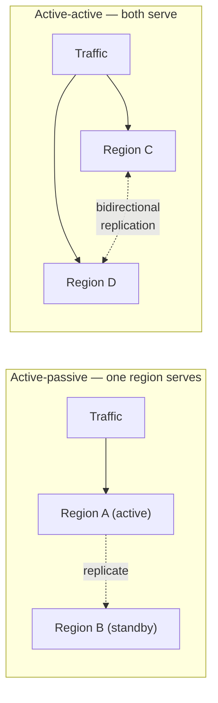
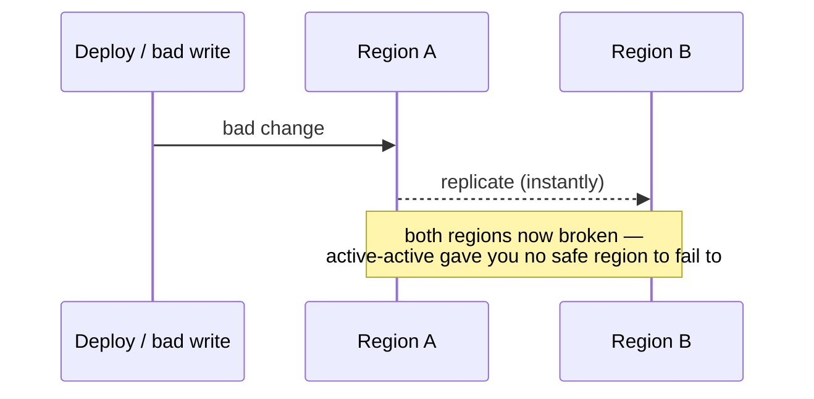

# ADR-003 — Multi-region active-active vs. active-passive

> Active-active is sold as maximum availability, but it protects against a **narrower** set of
> failures than its price implies — and introduces its own. Active-passive with fast, tested
> failover is often the honest choice. Active-active earns its cost only when you need
> near-zero-RTO regional survivability, or you're already multi-region for latency.

## Context

Once a system needs to survive the loss of a whole region, the question is whether both regions
serve traffic at once (active-active) or one serves while the other stands ready (active-passive).
The instinct is that active-active is strictly better because "both are live." It isn't strictly
better — it's a different set of tradeoffs, and the expensive one.

The right frame is a **spectrum of DR strategies**, each with a characteristic RTO (how long to
recover) and RPO (how much data you can lose). AWS's disaster-recovery guidance lays it out cleanly:

| Strategy | Typical RTO | Typical RPO | Steady-state cost | Shape |
|----------|-------------|-------------|-------------------|-------|
| Backup & restore | Hours | Hours | Lowest | Restore from backups after the event |
| Pilot light | 10s of min → hours | Minutes | Low | Core data replicated, most infra off |
| Warm standby | Minutes | Seconds | Medium | Scaled-down copy always running |
| **Multi-site active-active** | **Seconds** | **None → seconds** | **Highest** | Both regions serve; reroute on failure |

"Active-passive" in practice means pilot light or warm standby; "active-active" means multi-site.

[AUTHOR: the real system and topology, and the specific failure mode that forced this decision.]

## Options Considered

| Option | Cost / complexity | Protects against | Introduces / when right |
|--------|-------------------|------------------|-------------------------|
| **Active-passive** (warm standby) | ~1.5× infra; failover is the hard part to keep tested | Total region loss, with a short, bounded failover gap (RTO minutes, RPO seconds) | Failover that silently rots if never exercised. Right when you need region survivability but can tolerate a minutes-long, controlled cutover. |
| **Active-active** | ~2×+ infra, *plus* the real cost: cross-region data consistency | Total region loss with near-zero RTO; also serves latency from both regions | Split-brain, conflict resolution, and the fact that it **replicates your bad deploy or data corruption to both regions instantly**. Right when zero-RTO regional survivability is mandatory or you're already multi-region for latency. |

The sharp point: most outages are not clean region losses. They are bad deploys, dependency
failures, and data corruption — and active-active faithfully propagates all three to every region
in milliseconds:

It buys resilience to the failure mode that is *least* common and asks you to solve cross-region
data consistency to get it. Consistency across regions under partition is not a detail you tune
later — it is a hard, well-studied problem (the CAP tradeoff; the many correctness bugs Jepsen has
found in "globally consistent" stores are the evidence).

## Decision

[AUTHOR: which you chose, for which system, and the failure mode that decided it.] The reasoning
that should drive it: choose active-active only if the RTO gap of active-passive is genuinely
unacceptable *and* you can solve — or sidestep, via partitioned regional ownership (each record has
a home region) — cross-region data consistency. Otherwise active-passive with a **failover you
actually rehearse** delivers most of the protection at a fraction of the cost and complexity.

## Consequences

**What it buys.** Survival of a region-level failure, at an RTO matched to the target set in
[ADR-002](002-availability-target.md).

**What it costs — and when it's the wrong call.**

- **Active-active** makes cross-region data consistency your permanent problem, and its cost is paid
  every day, not just during a disaster. It is the wrong call when a bounded failover gap is
  acceptable — which is more often than its reputation suggests.
- **Active-passive** is only as good as the last time you tested failover. An untested standby is a
  false sense of security, not a DR strategy. [AUTHOR: your failover test cadence / a time it was
  exercised for real.]
- **Both** are the wrong call for systems that don't need to survive region loss at all — single-
  region with multi-AZ is the honest stop for most services (see [ADR-002](002-availability-target.md)).

## Status

draft — awaiting author specifics and review. Multi-region failover behavior is demonstrated in the
**[Payments Resiliency Simulator](https://github.com/raghavarora12/payments-resiliency-simulator)**.
Related: [ADR-002](002-availability-target.md); principle [[design-for-the-common-failure]].

## References

- AWS — [Disaster recovery options in the cloud](https://docs.aws.amazon.com/whitepapers/latest/disaster-recovery-workloads-on-aws/disaster-recovery-options-in-the-cloud.html) (RTO/RPO per strategy).
- [Jepsen](https://jepsen.io/analyses) — consistency-testing analyses of distributed databases (why cross-region "consistency" is hard).
- Google SRE — [Embracing Risk](https://sre.google/sre-book/embracing-risk/) (matching DR spend to the target).
