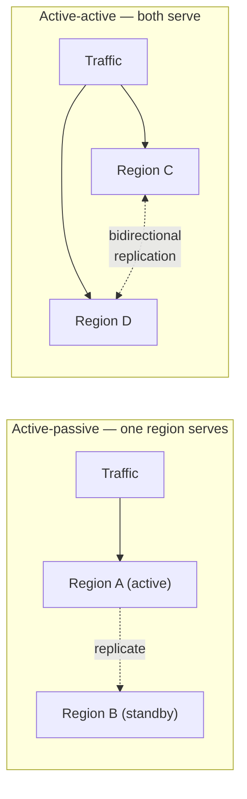
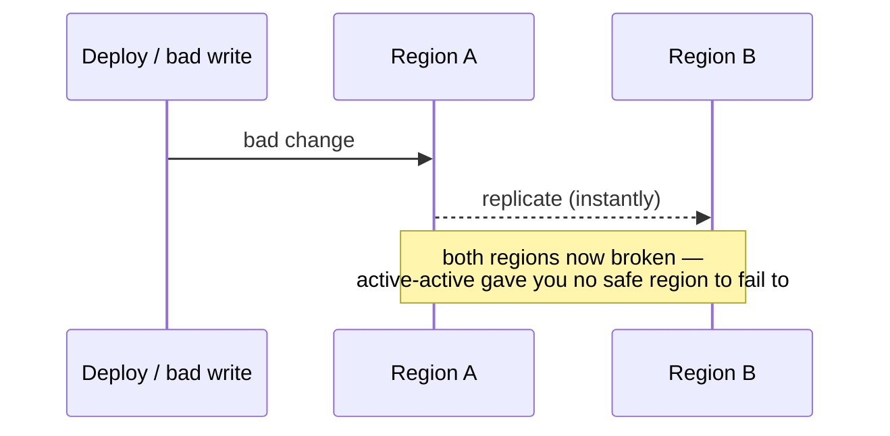
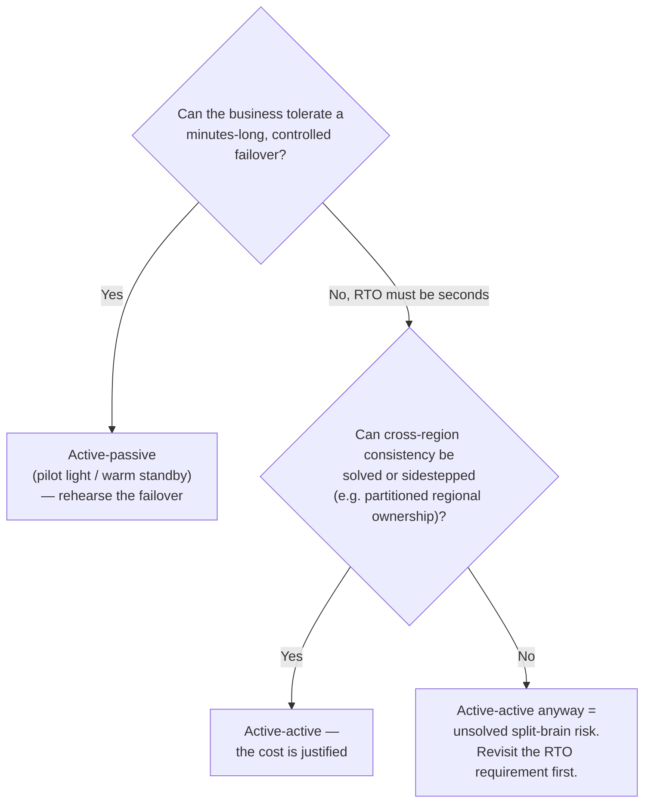

# ADR-003 — Multi-region active-active vs. active-passive

> Active-active is sold as maximum availability, but it protects against a **narrower** set of
> failures than its price implies — and introduces its own. Active-passive with fast, tested
> failover is often the honest choice. Active-active earns its cost only when you need
> near-zero-RTO regional survivability, or you're already multi-region for latency.

## Context

On 21 October 2018, a 43-second loss of connectivity hit the network hub between GitHub's US East
Coast datacentres. Orchestrator — the system managing MySQL topology — did exactly what it was
built to do: it detected that the primary side had lost quorum, and the West Coast and East Coast
public-cloud nodes formed a new quorum and failed writes over westward. Automatic failover worked.
That was the problem. When connectivity returned less than a minute later, both coasts held writes
the other didn't have. Rolling back either side meant destroying real, committed user data — so
GitHub's only option was to "fail forward": reconcile the two histories live, in production. The
43-second network blip took **24 hours and 11 minutes** to fully resolve.

![Timeline diagram: on 21 October 2018 a 43-second connectivity loss between GitHub's US East Coast network hub and primary datacentre causes Orchestrator to lose quorum; the West Coast and East Coast public-cloud nodes form a new quorum and fail writes over westward; when connectivity returns, both coasts hold writes the other lacks, so rolling back either side would destroy real user data; GitHub is forced to fail forward instead. The outcome: a 43-second trigger, 24 hours 11 minutes to fully restore service, and a forced fail-forward decision. Caption: what active-active actually costs is a consistency problem on your worst day.](assets/003-github-split-brain-anatomy.svg)

Once a system needs to survive the loss of a whole region, the question is whether both regions
serve traffic at once (active-active) or one serves while the other stands ready (active-passive).
The instinct is that active-active is strictly better because "both are live." GitHub's incident is
the counter-argument in miniature: active-active didn't fail to fail over — it failed over
*correctly*, by design, and that is exactly what produced an unresolvable data conflict. It isn't
strictly better than active-passive — it's a different set of tradeoffs, and the expensive one.

The right frame is a **spectrum of DR strategies**, each with a characteristic RTO (how long to
recover) and RPO (how much data you can lose). AWS's disaster-recovery guidance lays it out cleanly,
and the shape of the tradeoff is the same one ADR-002 makes about nines — cost rises far faster than
the RTO it buys:

| Strategy | Typical RTO | Typical RPO | Steady-state cost | Shape |
|----------|-------------|-------------|-------------------|-------|
| Backup & restore | Hours | Hours | Lowest | Restore from backups after the event |
| Pilot light | 10s of min → hours | Minutes | Low | Core data replicated, most infra off |
| Warm standby | Minutes | Seconds | Medium | Scaled-down copy always running |
| **Multi-site active-active** | **Seconds** | **None → seconds** | **Highest** | Both regions serve; reroute on failure |

"Active-passive" in practice means pilot light or warm standby; "active-active" means multi-site.

The failure mode multi-region topology is actually bought against matters here too. Uptime
Institute's 2025 Annual Outage Analysis found IT and networking issues now account for **23%** of
impactful outages, and human error is involved in a rising share — **up 10 percentage points** in a
single year. Every extra region is more topology, more replication paths, and more failover logic
for a human to misconfigure under pressure; the DR strategy you choose has to be judged against the
operational complexity it adds, not just the failure it protects against.

[AUTHOR: the real system and topology, and the specific failure mode that forced this decision.]

## Options Considered

| Option | Cost / complexity | Protects against | Introduces / when right |
|--------|-------------------|------------------|-------------------------|
| **Active-passive** (warm standby) | ~1.5× infra; failover is the hard part to keep tested | Total region loss, with a short, bounded failover gap (RTO minutes, RPO seconds) | Failover that silently rots if never exercised. Right when you need region survivability but can tolerate a minutes-long, controlled cutover. |
| **Active-active** | ~2×+ infra, *plus* the real cost: cross-region data consistency | Total region loss with near-zero RTO; also serves latency from both regions | Split-brain, conflict resolution, and the fact that it **replicates your bad deploy or data corruption to both regions instantly**. Right when zero-RTO regional survivability is mandatory or you're already multi-region for latency. |

The sharp point: most outages are not clean region losses. They are bad deploys, dependency
failures, and data corruption — and active-active faithfully propagates all three to every region
in milliseconds:

This is not a hypothetical. On 12 June 2025, a policy update with an unintended blank field landed
in the global Spanner tables behind Google Cloud's Service Control — the authorization layer nearly
every Google Cloud service calls on every request. Service Control is deliberately run active in
every region for low latency; that same design meant the corrupted policy data propagated globally
and crashed Service Control worldwide, taking down IAM, Compute Engine, Cloud Storage, and dozens of
dependent services — including Cloudflare, Spotify, and Discord — for over two and a half hours.
The failure mode wasn't a region going dark; it was a bad write, replicated everywhere, instantly,
exactly as designed.

It buys resilience to the failure mode that is *least* common and asks you to solve cross-region
data consistency to get it. Consistency across regions under partition is not a detail you tune
later — it is a hard, well-studied problem: the CAP tradeoff, Abadi's PACELC extension (the
latency/consistency tradeoff exists even *without* a partition), and the many correctness bugs
Jepsen has found in "globally consistent" stores are all the same evidence from different angles.

The decision aid:

## Decision

[AUTHOR: which you chose, for which system, and the failure mode that decided it.] The reasoning
that should drive it: choose active-active only if the RTO gap of active-passive is genuinely
unacceptable *and* you can solve — or sidestep, via partitioned regional ownership (each record has
a home region) — cross-region data consistency. Otherwise active-passive with a **failover you
actually rehearse** delivers most of the protection at a fraction of the cost and complexity.

Rehearsal is not optional flavor — it's the mechanism that makes the RTO in the table real rather
than aspirational. AWS's own guidance on **static stability** makes the sharper version of this
point: a standby only delivers the RTO you designed for if its capacity is already provisioned and
running *before* the failure, not scaled up reactively during one, when the very dependencies you'd
lean on (control planes, autoscalers, provisioning APIs) are the ones most likely to be degraded
alongside everything else.

## Consequences

**What it buys.** Survival of a region-level failure, at an RTO matched to the target set in
[ADR-002](002-availability-target.md).

**What it costs — and when it's the wrong call.**

- **Active-active** makes cross-region data consistency your permanent problem, and its cost is paid
  every day, not just during a disaster. It is the wrong call when a bounded failover gap is
  acceptable — which is more often than its reputation suggests.
- **Active-passive** is only as good as the last time you tested failover. An untested standby is a
  false sense of security, not a DR strategy. [AUTHOR: your failover test cadence / a time it was
  exercised for real.]
- **Both** are the wrong call for systems that don't need to survive region loss at all — single-
  region with multi-AZ is the honest stop for most services (see [ADR-002](002-availability-target.md)).

## Status

draft — awaiting author specifics and review. Multi-region failover behavior is demonstrated in the
**[Payments Resiliency Simulator](https://github.com/raghavarora12/payments-resiliency-simulator)**.
Related: [ADR-002](002-availability-target.md); principle [[design-for-the-common-failure]].

## References

- AWS — [Disaster recovery options in the cloud](https://docs.aws.amazon.com/whitepapers/latest/disaster-recovery-workloads-on-aws/disaster-recovery-options-in-the-cloud.html) (RTO/RPO per strategy).
- [Jepsen](https://jepsen.io/analyses) — consistency-testing analyses of distributed databases (why cross-region "consistency" is hard).
- Google SRE — [Embracing Risk](https://sre.google/sre-book/embracing-risk/) (matching DR spend to the target).
