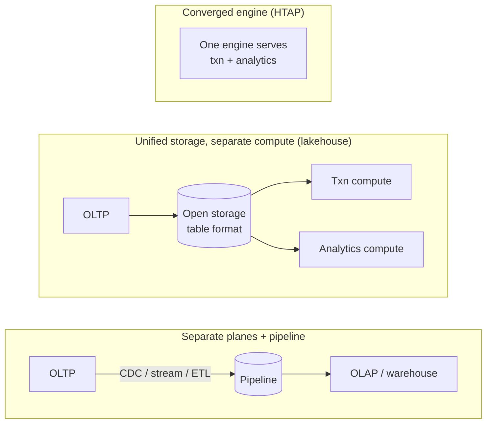

# ADR-004 — Converging operational & analytical data planes vs. keeping them separate

> Convergence (HTAP / streaming lakehouse) earns its complexity only under genuine live-latency
> pressure — decisioning on data fresher than a pipeline can deliver. For most workloads the
> classic OLTP/OLAP split with a pipeline between them is still the right, cheaper, more operable
> call. "Convergence is just the modern way" is a hot take, not an architecture.

## Context

Operational systems (OLTP) are tuned for many small, consistent transactions; analytical systems
(OLAP) for large scans over history. The long-standing pattern keeps them separate and moves data
between them with a pipeline. The newer pitch is convergence: one store that serves both, so
analytics run on live transactional data with no pipeline lag.

The question is not which is more modern. It is whether the freshness convergence buys is worth
the isolation it gives up. The honest read after a decade of HTAP is sobering: unifying both
workloads *in one engine* tends to collapse workload isolation and compromise performance for
both. The lakehouse response (Zaharia et al., CIDR 2021) is telling — it unifies at the **storage**
layer and keeps **compute** separate, precisely so analytical scans can't starve transactions.
That distinction — unify storage, isolate compute — is the crux of this decision.

[AUTHOR: the real converge-or-separate decision, the system, and the latency-sensitive use case
(e.g. fraud/risk decisioning) if one drove it.]

## Options Considered

| Option | Data freshness | Complexity / cost | Isolation & blast radius | When it's right |
|--------|----------------|-------------------|--------------------------|-----------------|
| **Separate + pipeline** | Minutes to hours (pipeline lag) | Two mature systems + a pipeline to operate | Strong: analytical scans can't starve OLTP; scale each independently | The default. Analytics tolerate lag; you want isolation and mature tooling. |
| **Unified storage, separate compute** | Seconds to minutes | One storage layer, multiple engines | Strong on compute, shared on storage — the pragmatic middle | You want one governed copy of data without coupling the two workloads' compute. |
| **Converged engine (HTAP)** | Live / sub-second | One system, less mature, more expensive | Weak: mixed workload contends on one engine; analytics share OLTP's blast radius | Decisions must be made on data fresher than the pipeline delivers, *and* that freshness is worth more than the isolation lost. |

## Decision

[AUTHOR: which you chose, for which system.] The test that should decide it: convergence into one
engine wins only when **the decision has to be made on data fresher than your pipeline latency, and
the value of that freshness exceeds the isolation you give up.** Live fraud/risk decisioning on
in-flight transactions is the canonical case that clears that bar. A daily revenue dashboard is not
— paying HTAP's contention and operational cost to make it "live" is complexity with no buyer.

For most "we want fresher analytics" needs, the honest answer is not a converged engine but either
a tighter pipeline (CDC/streaming, cutting lag from hours to seconds) or the unified-storage /
separate-compute shape — freshness without handing your transactional path a noisy neighbor.

## Consequences

**What it buys (convergence).** Decisions on live data without a pipeline in the critical path —
genuinely valuable where milliseconds of staleness change the answer.

**What it costs — and when it's the wrong call.**

- **Contention and blast radius.** In a single engine, a heavy analytical scan can now hurt your
  transactional path. You've coupled two workloads that separation kept apart.
- **Operational maturity and cost.** Converged HTAP engines are younger and pricier than the
  battle-tested OLTP and OLAP stacks they replace.
- **When it's simply wrong:** any workload whose analytics tolerate minutes of lag — which is most
  of them. Convergence there buys freshness nobody needs at the price of isolation everybody wants.
- **Keeping them separate** costs you freshness and a pipeline to run — the right price to pay unless
  live latency is genuinely load-bearing. [AUTHOR: the freshness SLA that actually mattered for your
  case.]

## Status

draft — awaiting author specifics and review. Builds on
[ADR-001](001-canonical-data-model-at-ingestion.md) — canonicalized data is what makes either plane
trustworthy. Related: [ADR-001](001-canonical-data-model-at-ingestion.md).

## References

- Zaharia, Ghodsi, Xin, Armbrust — [Lakehouse: A New Generation of Open Platforms](https://people.eecs.berkeley.edu/~matei/papers/2021/cidr_lakehouse.pdf), CIDR 2021.
- [HTAP: Still the Dream, a Decade Later](https://medium.com/@danthelion/htap-still-the-dream-a-decade-later-9d168f07c759) (why one-engine convergence keeps disappointing).
