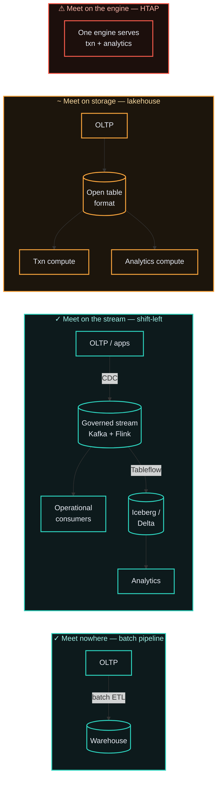
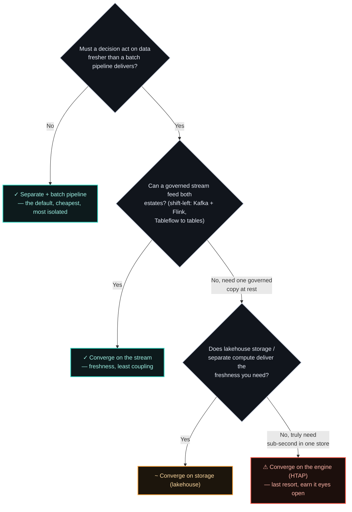

# ADR-004 — Converging operational & analytical data planes vs. keeping them separate

> "Converge the operational and analytical worlds" is a mindset, not a product — and the real
> decision is *which layer* you let them meet at: the **engine**, the **storage**, or the
> **stream**. Converging in one engine (HTAP) almost never pays. Converging on a governed stream
> (shift-left) or shared open storage (lakehouse) usually does. The further upstream you push the
> meeting point, the less you couple — and fresh data is worth buying, but coupled compute and a
> shared blast radius are not.

## Context

In October 2024, Snowflake shipped the industry's most ambitious bet on convergence yet: Unistore
hybrid tables, generally available in commercial AWS regions and announced at BUILD that November —
one engine meant to serve transactional and analytical workloads at once. It launched a long way
short of OLTP-grade: default quotas of roughly **1,000 operations per second** and **500 GB** of
active data (both raisable on request), and no materialized views, cloning, streams, or
replication. Snowflake has kept working on it since — the quotas now sit at roughly 16,000
operations per second and 2 TB per database, Azure is supported, and a June 2026 release claims up
to 8x higher point-operation throughput. Check the current numbers before quoting them; the point
that outlasts them is the starting position. The most ambitious convergence attempt in the industry
reached general availability with quotas a commodity Postgres box would clear on a laptop, and it
took the better part of two years of engineering to move them meaningfully.

What the two biggest analytical platforms did next is the more interesting evidence. In May 2025
Databricks acquired **Neon**, a dedicated Postgres provider, for around $1B; in June 2025 Snowflake
acquired **Crunchy Data**, another dedicated Postgres provider, for around $250M. Each bought a
separate, purpose-built OLTP engine rather than extending its analytical engine to cover the same
ground. Both framed the deals around AI agents needing Postgres rather than around HTAP, so read
the conclusion as inference, not confession — but it is the same inference the practitioners below
draw.

![Timeline diagram: in October 2024 Snowflake's Unistore hybrid tables reach general availability in AWS regions, the industry's most ambitious single-engine HTAP bet yet; it launches far short of OLTP-grade — default quotas of roughly 1,000 operations per second and 500 gigabytes of active data, both raisable on request, and no materialized views, cloning, streams, or replication; in May 2025 Databricks acquires Neon, a dedicated Postgres provider; in June 2025 Snowflake acquires Crunchy Data, another dedicated Postgres provider. Verdict: compose two engines, don't converge into one — both bought a dedicated Postgres engine rather than extend their analytical one. Footnote: Snowflake has since raised the quotas to roughly 16,000 operations per second and 2 terabytes per database; the starting position is the point, not the number.](assets/004-htap-decade-verdict.svg)

Operational systems (OLTP) are tuned for many small, consistent transactions; analytical systems
(OLAP) for large scans over history. The long-standing pattern keeps them separate and moves data
between them with a pipeline. The newer pitch is convergence: one store that serves both, so
analytics run on live transactional data with no pipeline lag.

The question is not which is more modern. It is whether the freshness convergence buys is worth
the isolation it gives up. The honest read after a decade of HTAP is sobering, and Snowflake's
Unistore is only the latest data point: unifying both workloads *in one engine* tends to collapse
workload isolation and compromise performance for both. The lakehouse architecture (Zaharia et al.,
CIDR 2021) suggests where the seam belongs — it unifies at the **storage** layer and keeps
**compute** separate. The paper argues that split on grounds of staleness, reliability and cost
rather than workload isolation, but the shape it produces is the one that matters here: analytical
scans that can't starve the transactional path because they never share an engine with it. Unify
storage, isolate compute — that distinction is the crux of this decision, and the major platforms
have broadly settled on it, shipping composed architectures (dedicated OLTP and OLAP engines joined
by CDC or zero-ETL replication) rather than a single engine doing both. As Mooncake Labs co-founder
Zhou Sun put it in [HTAP is Dead](https://neon.com/blog/htap-is-dead) (May 2025), writing from a
decade of building HTAP systems at SingleStore: "it's still HTAP; but through composition instead of
consolidation of databases."

But the database is only one place the two worlds can meet — and, it turns out, the worst one. The
streaming camp, Confluent most vocally, makes the opposite bet: converge on the **stream**, not the
engine. Its "shift-left" thesis moves processing and governance *upstream*, onto the event log
itself, so a single well-formed data product is produced once and consumed both ways — by
operational systems through Kafka's API, and by the analytical estate as tables. Stream/table
duality is what makes that coherent: a log and a table are two projections of the same data (Kreps'
point), and Confluent's Tableflow leans on it directly —
materialising Kafka topics as Iceberg tables (GA March 2025) or Delta tables (GA October 2025) so
analysts query the same governed stream operational services are already reading. It is the same
instinct as [ADR-001](001-canonical-data-model-at-ingestion.md): fix the data once, at the
boundary — here applied to the operational/analytical divide rather than the ingestion one.

Seen this way, the decision isn't "converge or stay separate." It is **at which layer you let the
two estates meet — and the further upstream you push that point, the less you couple**. Meet at the
engine and you share compute, storage, *and* blast radius. Meet at storage (lakehouse) and you share
one governed copy but isolate compute. Meet at the stream and you share only an upstream product,
while each estate scales its own reads independently. Engine convergence couples at the worst layer;
stream convergence at the best. That reframing — not "is convergence modern?" — is what this ADR
turns on.

## Options Considered

Four options, ordered by *where* they let the two estates meet — loosest coupling on the left,
tightest on the right:

| Option | Converges at | Data freshness | Isolation & blast radius | When it's right |
|--------|--------------|----------------|--------------------------|-----------------|
| **Separate + batch pipeline** | Nowhere — data is copied between two stores | Minutes to hours (pipeline lag) | Strongest: analytical scans can't touch OLTP; scale each independently | The safe default. Analytics tolerate lag; you want isolation and mature tooling. |
| **Stream / shift-left (DSP)** | The event log — one governed product, consumed both ways | Seconds | Strong: consumers scale independently; the shared upstream is read-only, not shared compute | You want fresh analytics *and* reusable operational data from one governed source. Confluent's Tableflow → Iceberg is this shape; the same shift-left instinct as [ADR-001](001-canonical-data-model-at-ingestion.md). |
| **Unified storage, separate compute (lakehouse)** | Storage — one open table format, many engines | Seconds to minutes | Strong on compute, shared on storage — the pragmatic middle | You want one governed copy of data at rest without coupling the two workloads' compute. |
| **Converged engine (HTAP)** | The engine — one store serves both | Live / sub-second | Weak: mixed workload contends on one engine; analytics share OLTP's blast radius | A decision needs data fresher than *any* pipeline delivers, *and* that freshness outweighs the isolation lost. Rare — and the vendors best placed to build it bought dedicated OLTP engines instead. |

The decision aid below encodes one rule of thumb: **push the meeting point as far upstream as it
will go.** Reach for the engine only when the stream and storage layers genuinely can't deliver.

Two cases, run through it:

**Fraud and risk decisioning** — learning from each transaction and applying it to the next. This is
the case HTAP was built for: the lag between learning and applying *is* the product, and no pipeline
beats one engine on it. It is also where the argument for one engine breaks. Fraud traffic is spiky,
and the decision has to hold its latency at peak — exactly when a shared engine's analytical side is
competing for the same capacity. Both bars are real and they point opposite ways: freshness says
converge, elastic scale says don't. I weigh scale heavier, so this lands on the stream — giving up
milliseconds to buy back elasticity and a cleaner operational story.

**End-of-day analytics on operational data** — reports, trend analysis, periodic decisioning. No
latency pressure, so batch is the obvious fit and stays the cheapest answer. Where a lakehouse or a
governed stream is already carrying other workloads, routing this through it consolidates what you
operate. Converge because you are already paying for the platform, not to make the report fresher.

## Decision

No single pattern generalises across systems — each use case has to be assessed on its own
operational stability, scalability and maintainability. But "it depends" is not a decision, so here
is the default I hold to: **meet as far upstream as the workload allows, and treat the engine as the
layer you have to earn.**

The test that should decide it: converging *into one engine* wins only when **the decision has to act
on data fresher than any pipeline can deliver, and that freshness is worth more than the isolation
you give up.** Live fraud/risk decisioning on in-flight transactions is the one case that clears that
bar — and, as the case above shows, the one where I would still hesitate. It passes the test as
written and fails a second one the test doesn't ask about: elastic scale under spiky load. I am not
going to pretend that resolves cleanly. A daily revenue dashboard doesn't even reach the question —
paying HTAP's contention and operational cost to make it "live" is complexity with no buyer.

But that is the *last* question to ask, not the first. For most "we want fresher analytics" needs
the honest answer isn't a converged engine at all — it's to **converge further upstream**. A
shift-left streaming platform (CDC into a governed Kafka stream, Flink to shape it, Tableflow to
materialise it as Iceberg/Delta tables) gives operational *and* analytical consumers one governed
source at seconds of latency, without ever coupling their compute. The lakehouse shape does the same
at the storage layer. Both deliver the freshness people actually ask for while keeping the
transactional path free of a noisy neighbour — which is why the engine should be the option you
reach for only when the stream and storage layers have genuinely run out.

## Consequences

**What it buys.** Fresh data shared across both estates without a batch pipeline in the critical
path — genuinely valuable where minutes of staleness change the answer, and (in the stream and
lakehouse shapes) a single *governed* copy that both sides trust.

**What it costs — and when it's the wrong call.**

- **Engine convergence — contention and blast radius.** In one engine a heavy analytical scan can
  hurt your transactional path; you've coupled two workloads that separation kept apart. These
  engines are also younger and pricier than the battle-tested OLTP and OLAP stacks they replace.
- **Stream convergence isn't free either.** Shift-left buys you the loosest coupling, but you now
  run a streaming platform — Kafka, Flink, schema/contract governance — and Tableflow's own
  tradeoff bites: optimise for latency and you land many small files that are slow to scan; optimise
  for scan efficiency and you reintroduce latency. It complements the OLTP database and the
  warehouse; it does not delete either.
- **Lakehouse convergence** shares storage, so table maintenance (compaction, snapshot expiry) and
  governance of the open format become a standing operational job.
- **When convergence is simply wrong:** any workload whose analytics tolerate minutes of lag — which
  is most of them. A batch pipeline there buys isolation everybody wants at a price everybody can
  pay; forcing "live" onto it is complexity with no buyer. End-of-day and monthly reporting is the
  clearest example — nobody acts on those numbers before the batch lands.

## Status

Accepted. Builds on
[ADR-001](001-canonical-data-model-at-ingestion.md) — canonicalized data is what makes either plane
trustworthy, and the shift-left convergence path is the same instinct applied to a different
boundary. The stream-as-substrate option leans directly on
[ADR-005](005-coupling-across-domains.md) — the log as the unifying abstraction; what
happens to that log when a region is lost is [ADR-006](006-multi-region-kafka-high-availability.md).
Related: [ADR-001](001-canonical-data-model-at-ingestion.md),
[ADR-005](005-coupling-across-domains.md).

## References

- Zaharia, Ghodsi, Xin, Armbrust — [Lakehouse: A New Generation of Open Platforms](https://people.eecs.berkeley.edu/~matei/papers/2021/cidr_lakehouse.pdf), CIDR 2021 — unification at the storage layer, with compute left independent.
- Dani Palma — [HTAP: Still the Dream, a Decade Later](https://medium.com/@danthelion/htap-still-the-dream-a-decade-later-9d168f07c759) (June 2025) — why one-engine convergence keeps disappointing.
- Zhou Sun — [HTAP is Dead](https://neon.com/blog/htap-is-dead) (May 2025) — a decade of building HTAP at SingleStore, ending at "composition instead of consolidation."
- Snowflake — [Limitations and unsupported features for hybrid tables](https://docs.snowflake.com/en/user-guide/tables-hybrid-limitations) and [October 30, 2024 — Hybrid tables GA](https://docs.snowflake.com/en/release-notes/2024/other/2024-10-30-hybrid-tables-ga) — the primary sources for Unistore's GA date and its current quotas (~16,000 ops/sec, 2 TB per database). Also [Hybrid Tables Just Got Up to 8x Faster](https://www.snowflake.com/en/blog/hybrid-tables-performance-improvements/) (June 2026) — Snowflake is still investing here, not walking away.
- ClickHouse — [Unifying OLTP and OLAP: HTAP databases, zero-ETL, and best-of-breed architectures](https://clickhouse.com/resources/engineering/unifying-oltp-and-olap) — the composed-architecture argument, and the source of the launch-era Unistore quotas quoted above. Read it knowing ClickHouse is a competitor and the page cites no source for those figures; the Snowflake docs above are the check on it.
- Confluent — [What is shift left in data integration?](https://www.confluent.io/learn/what-is-shift-left/) — the case for moving processing and governance upstream onto the stream, feeding operational and analytical consumers from one governed product rather than duplicating pipelines downstream.
- Confluent — [Tableflow: Kafka topics as Iceberg and Delta Lake tables](https://docs.confluent.io/cloud/current/topics/tableflow/overview.html) (Iceberg GA March 2025, Delta Lake GA October 2025) — the mechanism that lets the analytical estate read the operational stream as tables, which Confluent pitches as unifying the operational and analytical estates.
- Jack Vanlightly — [Tableflow: the stream/table, Kafka/Iceberg duality](https://jack-vanlightly.com/blog/2024/3/19/tableflow-the-stream-table-kafka-iceberg-duality) (2024) — the honest technical account: a log and a table are two projections of the same data, and the latency-vs-small-files tradeoff that convergence on the stream still has to pay.

---

*Where the operational and analytical planes should meet is rarely settled by the architecture
diagram alone. If you're working that boundary, I'd genuinely enjoy comparing notes —
[get in touch](../README.md#get-in-touch).*
