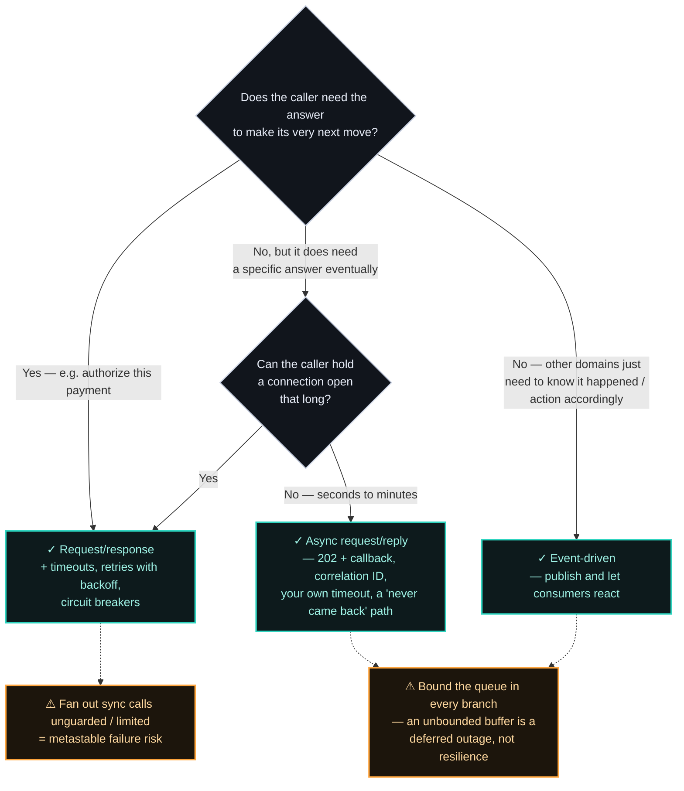

# ADR-005 — Coupling across domains: the question agent chains made urgent again

> Choose by coupling and failure semantics, not fashion. Request/response when the caller genuinely
> can't proceed without an answer. Async request/reply when it needs *an* answer but not on this
> thread. Event-driven when domains should evolve independently and the producer shouldn't know — or
> wait for — its consumers. Async is a liability precisely where you need an immediate, consistent
> answer. And whichever you pick, bound the buffer: backpressure is the difference between a queue
> and an outage. This question is fifteen years old and newly urgent — an agent chain is the same
> fan-out with a far worse tail, and the industry is relearning the answer at model latency.

## Context

By 2011, Netflix's API was taking in more than **1 billion calls a day**, fanning out at roughly
**1:6** to dozens of backing subsystems, with peaks over **100,000 dependency requests per
second**. Every one of those fan-out calls was synchronous — the API had to wait for an answer
before it could respond to the device asking for a home screen or a stream URL. That's a
defensible design until one dependency goes slow instead of cleanly down. A clean failure is easy;
a *slow* one is what actually happens, and because all six calls shared the same caller's thread
pool, one latent dependency was enough to exhaust it in seconds — silently blocking requests to
the other five dependencies, which were perfectly healthy. Netflix's fix, published in 2012 and
later open-sourced as **Hystrix**, was to isolate every dependency behind its own circuit breaker,
so one slow call could only ever cost its own slice of capacity.

Don't reach for Hystrix itself — Netflix put it in maintenance mode in 2018 and moved to adaptive
concurrency limits that infer a safe ceiling from live latency rather than from a threshold someone
tuned by hand a year ago. The library aged out; the isolation pattern didn't. That distinction is
worth holding onto, because the pattern is about to matter more than it ever did.

When one domain needs something from another, the communication style is a coupling decision, not a
transport detail. Request/response couples the caller's availability to the callee's. Event-driven
decouples them in time but trades away the immediate, consistent answer. Picking the wrong one
shows up later as either cascading failures (sync where you needed async) or impossible-to-reason-
about eventual consistency (async where you needed a straight answer).

The physics matter. A synchronous call is not free: an in-datacenter round trip is ~**0.5 ms**, but
a cross-continent round trip is ~**150 ms** (Dean; "Latency Numbers Every Programmer Should Know").
Chain several synchronous calls across domains and those numbers add — and, worse, the whole chain
inherits the **tail latency** of its slowest dependency ("The Tail at Scale," Dean & Barroso): a
service fanning out to many synchronous dependencies is as slow as the slowest one on any given
request, and its p99 degrades fast. Bronson et al. (formerly Meta/Facebook) gave this pattern a
name in 2021 — **metastable failure**: a system that is stable under normal load can get trapped in
a self-sustaining degraded state after a small trigger, typically because retries and synchronous
fan-out amplify a load spike instead of absorbing it ("Metastable Failures in Distributed Systems,"
HotOS 2021). Circuit breakers and backoff aren't defensive-coding hygiene — they're the mechanism
that keeps a synchronous chain from tipping into exactly that trap.

### The same argument, at model latency

All of that was settled engineering by about 2015, which is why this reads like a dated debate. **It
isn't**. Agentic systems have reintroduced the identical failure mode with the constants moved by
three orders of magnitude, and they have done it to teams who never had to learn the first lesson.

A model call is a synchronous dependency measured in seconds, not milliseconds, and its latency
varies wildly between two requests with the same shape. An agent step that plans, retrieves, calls
two tools and verifies is a fan-out of exactly the Netflix shape — except every leg is thousands of
times slower and none of them has a predictable tail. Chain five agents that call each other
directly and you have multiplied five availabilities and summed five tails, which is the arithmetic
Dean & Barroso described, now applied to dependencies that were never fast to begin with.

The industry is converging on the answer it reached last time: put an event-driven topology between
them. Microsoft rebuilt AutoGen from scratch in v0.4 (full release early 2025) around an
asynchronous, event-driven actor model, on the grounds that it "decouples how the messages are
delivered between the agents from how the agents handle them." Confluent's guidance is blunter —
"in a production-grade multi-agent system, agents never call each other directly," because "direct
API or function calls between agents create tight coupling, synchronous failure propagation, and
implicit dependencies," and "over time, the system collapses into a distributed monolith."

![Diagram: the same fan-out shape drawn twice, side by side. On the left, Netflix in 2011 — one caller fanning out roughly one to six across dozens of backing subsystems, at more than a billion calls a day and over 100,000 dependency requests per second at peak, where a round trip inside the datacentre is about half a millisecond and across a continent about 150 milliseconds, and the tail is predictable. One dependency goes slow and exhausts the shared thread pool within seconds, blocking the healthy five. On the right, an agent chain in 2026 — one agent fanning out across plan, retrieve, two tool calls and verify, where every leg is a model call measured in seconds rather than milliseconds and none of them has a dependable tail, so five availabilities multiply and five tails sum. A badge between the two panels reads: same shape. Along the bottom, the fix is the same both times — put a bus between them: Microsoft rebuilt AutoGen v0.4 on an asynchronous event-driven actor model that decouples how messages are delivered from how agents handle them, and Confluent states that in a production-grade multi-agent system agents never call each other directly, because over time the system collapses into a distributed monolith. The closing caption reads: the coupling question didn't age — the callees just got slower.](assets/005-same-shape-new-constants.svg)

"Distributed monolith" is the phrase to notice — it is the failure that microservices spent a decade
learning to name, arrived at again from a completely different direction. The coupling question
didn't go away. The callees just got slower, and the cost of getting it wrong went up.

## Options Considered

```mermaid
sequenceDiagram
    participant A as Domain A
    participant B as Domain B
    Note over A,B: Request/response (synchronous)
    A->>B: request
    rect rgb(28, 21, 12)
    B-->>A: response (A blocks until it returns)
    end
```

```mermaid
sequenceDiagram
    participant A as Domain A
    participant B as Domain B
    Note over A,B: Async request/reply (202 + callback)
    A->>B: submit work
    rect rgb(20, 24, 34)
    B-->>A: 202 Accepted + reference
    Note over A: A is free — the reply is still owed
    B->>A: response (callback / webhook with the result)
    end
```

```mermaid
sequenceDiagram
    participant A as Domain A
    participant Bus as Event platform
    participant B as Domain B
    participant C as Domain C
    Note over A,C: Event-driven (asynchronous)
    A->>Bus: publish event
    rect rgb(13, 26, 28)
    Bus-->>B: deliver
    Bus-->>C: deliver
    Note over A: A does not wait for its consumer
    end
```

| Option | Coupling | Failure behavior | Cost / when right |
|--------|----------|------------------|-------------------|
| **Request/response** (REST/gRPC) | Temporal — caller needs callee up *now* | Callee down → caller blocked; risk of cascading failure without timeouts/circuit breakers; tail-latency amplification across a fan-out | Simple to reason about; right when the caller truly cannot proceed without the answer (e.g. authorize a payment). |
| **Async request/reply** (202 + callback/webhook, or poll a status URL) | Temporal coupling *only for the reply* — caller still knows the callee and still expects a specific answer | Caller isn't blocked, so no thread exhaustion — but the reply can be late, lost, or duplicated. You now own correlation IDs, a timeout on *your* side, and a "never came back" path | The honest middle. Right when the caller needs an answer but the work is too slow to hold a connection open — long-running jobs, downstream approvals, model calls measured in seconds. Costs you a state machine the synchronous version didn't need. |
| **Event-driven** (pub/sub) | Decoupled — producer doesn't know consumers | Consumer down → events buffer; producer unaffected | Resilience and independent evolution, paid for with eventual consistency, ordering/idempotency burden, and harder tracing/debugging. Right when domains should evolve and fail independently. |

The middle row is the one teams skip, and it is usually the one they needed. "We can't make this
synchronous, so it has to be an event" is a false step — an event says *something happened* to
whoever cares; async request/reply says *I asked you specifically, and I am still owed an answer*.
Those are different contracts with different failure modes, and the tooling has followed the split:
OpenAPI covers the middle row with callbacks and webhooks, while AsyncAPI exists because callbacks
break down as soon as you have fan-out topics or consumer groups. They are complementary, not
competing — which is the clearest signal that these really are three modes and not two.

The rows don't change for agents; only the numbers do. A synchronous agent-to-agent call is the
first row with a callee that takes seconds and has no dependable tail — which is why the row's
failure column, not its simplicity column, should decide it.

### Backpressure is not a fourth option — it's what keeps the other three honest

Reactive streams get discussed as if they were another coupling choice. They aren't. Choosing
request/response over pub/sub is a question about *who waits for whom*; backpressure is a question
about *what happens when the producer is faster than the consumer*, and it applies to all three rows
above.

It matters here because it is the missing half of the argument the Context already makes. The
Reactive Streams specification exists to govern exchange across an asynchronous boundary "while
ensuring that the receiving side is not forced to buffer arbitrary amounts of data" — the consumer
signals how much it is willing to receive, via `Subscription.request()`, and the producer may not
exceed it. The JVM interfaces landed in JDK 9 as `java.util.concurrent.Flow`, semantically identical.

Read that against Bronson et al.: metastable failure is what happens when a system *absorbs* a load
spike into unbounded queues and retries until it can no longer drain them. An unbounded buffer is
not resilience — it is a deferred outage with worse diagnostics, because the queue looks healthy
right up until it doesn't. Bounded demand is the mechanism that converts "we amplified the spike"
into "we shed or slowed at the edge." Circuit breakers stop a *slow dependency* from taking the
caller down; backpressure stops a *fast producer* from taking the consumer down. You need both, and
most systems only ever install the first.

Which is why the event-driven row is not a free pass: publishing to a broker moves the buffer, it
doesn't bound it. Consumer lag is the same problem wearing a dashboard.

The decision aid:

### Five cases from payments and banking, run through it

#### Use-case 1: Transaction authorization
- A merchant initiates a transaction from the source (user / scheduled / recurring / kiosk) to authorize $x.y
- The acquirer acquires it and forwards it to the payment network
- The network assesses and verifies it against the issuer (bank / institution / building society), or stands in
- The decision is made and returned back down the chain to acquirer → merchant

**Observations:** 
- Domains: merchant/POS, gateway, acquirer, scheme network, issuer authorization host, fraud scoring, stand-in. 

**Verdict: Synchronous end to end, and it isn't a close call** 
- Somebody is standing at a terminal, a pump, or a turnstile, and there is no version of "eventually" that helps
them. Every party in the chain is temporally coupled to every other, which means the chain is only as
available as its weakest link. 
- Above cost is accepted deliberately, and the interesting part is what
the schemes built *because* of it: **stand-in processing**, where the network answers on the issuer's
behalf when the issuer can't. That is precisely this ADR's pattern — bound the wait, and have a
fallback authority ready rather than letting a timeout become a decline. Payments solved
slow-dependency-in-a-synchronous-chain before Netflix named it, and solved it the same way: not by
retrying harder, but by deciding in advance who answers when the callee doesn't.

#### Use-case 2: Transaction processing across lifecycle stages
- Once authorised, the transaction moves through network interchange calculation, then pricing deductions for acquirers and issuers
- Eventual money movement (clearing / settlement) and release of funds
- Reconciliation across parties and regulatory activity

**Observations:** 
- Domains: interchange calculation, acquirer/issuer pricing and billing, clearing,
settlement, treasury/funding, reconciliation, regulatory reporting. 

**Verdict: Event-driven, and this is where the log earns its keep.** 
- The answer already exists — authorization decided it. Everything
here is a stage transition on a fact that already happened, and the deadlines are cut-off windows
measured in hours and days, not milliseconds. 
- Nobody is waiting. Publishing each transition lets
reconciliation and regulatory reporting attach as consumers without the clearing path knowing they
exist, which is the one place "add a consumer without touching the producer" is worth real money,
because regulatory consumers arrive on somebody else's schedule.
- The cost the table warns about is not optional here: money movement has to be *effectively*
exactly-once, so ordering and idempotency stop being hygiene and become the design — the duplicate
window of [ADR-006](006-multi-region-kafka-high-availability.md), closed by the ledger rather than by
the broker. 
- Sync would be actively wrong: chaining clearing behind settlement behind pricing means a
slow treasury system stalls interchange calculation for transactions authorized cleanly hours ago.

#### Use-case 3: Fraud and risk decisioning
- Learning from each transaction and applying it to the next. The learning can happen
  asynchronously; applying it to the next transaction may need to be synchronous, if it happens
  during authorization (use-case 1)
- Fraud traffic is spiky, and the decision has to hold its latency at peak

**Observations** 
- Domains: the authorization path itself, feature store, scoring service, model
training, case management, chargeback/disputes. 

**Verdict: both — and the boundary between them is the entire decision.** 
- Scoring during authorization sits *inside* use-case 1's budget, so it inherits
it: a synchronous call with a hard deadline and — the part teams skip — a **pre-decided fail-open or
fail-closed behaviour**, because "the scorer didn't answer in time" is a business decision about
fraud loss versus false declines, not something to leave to an exception handler. 
- Learning is the
opposite shape entirely: feature updates, retraining, and labels that arrive weeks later when a
chargeback lands. That belongs on the event stream.
- The two sides should share data and never share a call path. Spiky traffic is exactly why:
fraud load peaks when you can least afford a contended dependency.

#### Use-case 4: Banking mobile app features
- Critical capabilities like displaying transactions from the ledger, and funds transfer from the
  app
- Core capabilities like transaction history and value-added features

**Observations:** 
- Domains: core banking ledger, payment initiation, notification, offers/insights.

**Verdict: split — but on read-your-own-writes, not on "criticality" in the abstract.**
- The question
that decides each screen is *can the customer catch you being wrong?* A balance rendered right after
a transfer must be authoritative, so it is a synchronous read against the ledger: the customer just
moved money and will pull to refresh. Getting that wrong is not a stale cache, it is a support call
and possibly a complaint. The transfer confirmation is the same — they need to know it happened, now.
- Everything the customer cannot immediately falsify — history beyond the recent window, categorisation,
spend insights, offers — is served fine from a read model projected off the event stream, where
seconds of lag are invisible.
- This is also the clearest home for the middle row: a transfer that needs downstream checks is usually
better modelled as accept-with-a-reference and notify on completion than as an app held on a spinner
against a chain the phone can't see.

#### Use-case 5: End-of-day analytics on operational data
- Scheduled reports, trend analysis, periodic decisioning

**Observations:** 
- Domains: operational stores, warehouse/lakehouse, reporting and regulatory consumers. 

**Verdict: Batch — and this ADR should defer rather than re-litigate.** 
- There is no latency pressure at all; the report is read the next day. Batch buys the strongest isolation at
the lowest cost, and this is the one case in the five where the coupling question genuinely doesn't
carry much weight. 
- The only reason to converge on a governed stream or a lakehouse here is that one
already exists for other workloads and routing this through it consolidates what you operate — which
is [ADR-004](004-operational-vs-analytical-data-planes.md)'s argument, not this one's. 
- Making an end-of-day report "live" is complexity with no buyer.

## Decision

There is no single answer that generalises across systems — the rule that should decide it: **does the caller need the answer to make its next move?** 
- If yes — an authorization, a balance check, a synchronous validation — use request/response and protect it with timeouts, retries with backoff, and circuit breakers. 
- If no — a state change other domains merely need to *know about* — publish an event and
let them react on their own schedule.

Add the middle row where it belongs: when the caller needs a *specific* answer but cannot hold a
connection open for it, that is async request/reply — a correlation ID, a timeout you own, and an
explicit path for "it never came back." Reaching for an event there is a category error; you don't
need to broadcast that something happened, you need your answer.

The five cases above show the split in practice, and the ratio is the point. Most cross-domain
communication in a payments platform is the *something happened* kind — the entire post-authorization
lifecycle — which is why event-driven is the backbone. But the moments that are the first kind
(is this authorized?) must stay synchronous, and getting that boundary wrong is the expensive
mistake. Where a single flow contains both — fraud scoring inside the authorization budget, learning
outside it — the boundary between them is the design, not an implementation detail.

Whichever row you land on, bound the queue. An unbounded buffer isn't the safe default; it is the
metastable failure mode with a longer fuse.

**The same rule decides agent topology, and it decides it harder.** When the callee is a model, "does
the caller need the answer to make its next move?" has to be asked per step rather than per service,
and the honest answer is *no* far more often than agent frameworks encourage — a plan step, an
enrichment, a verification, a downstream notification are all things other components need to
*know happened*, not things the caller must block on. Reserve synchronous agent calls for the step
whose result genuinely gates the next one, and give every one of them a timeout you chose
deliberately, because the default is usually the model provider's, not yours.

**And sub-agents are where this stops being theoretical.** A supervisor that spawns N children and
blocks until all N return is Netflix 2011 with the constants moved: completion time is the *maximum*
of N tails, not the average, so the more sub-agents you spawn to go faster, the more reliably you
inherit the worst one. Spawning them asynchronously changes the shape into scatter-gather with
independent completion — per-child deadlines, stragglers cancelled rather than waited on, and partial
results treated as a first-class outcome instead of an error. That last part is what actually makes
multi-agent worth doing: four good answers and one timeout is usually a result, and only a
synchronous join turns it into a failure.

The recursive case deserves naming, because it is the one that takes systems down. Children that
spawn children is unbounded fan-out — the load-amplification shape Bronson et al. described, now
self-inflicted by a planner that decided a task needed decomposing one more time. Bound it
explicitly: maximum depth, maximum concurrent children, and a token or cost budget the supervisor
enforces and children inherit. This is backpressure applied to *spawning* rather than to messages,
and it is the check most agent frameworks still leave to the author.

None of which is new. Mailboxes, supervision hierarchies, and letting a child fail without taking the
parent with it are the actor model's oldest ideas — which is exactly what AutoGen v0.4 rebuilt onto,
and exactly why the arithmetic in this ADR transfers without modification.

## Consequences

**What it buys (event-driven).** Domains that fail and evolve independently; natural buffering under
load; new consumers added without touching the producer.

**What it costs — and when it's the wrong call.**

- **Eventual consistency and debugging cost.** "Where did this state come from?" spans services and
  time. You take on ordering, idempotency, and distributed tracing as standing obligations.
- **Async is wrong when you need an answer now.** Modeling an authorization as fire-and-forget to
  "decouple" it is how you get a system that can't tell you whether a payment went through.
- **Request/response is wrong** as the default for everything — sync-calling a chain of domains turns
  one slow dependency into a system-wide outage.
- **Async request/reply buys you a state machine you didn't have.** The middle row removes the
  blocked thread and hands you correlation IDs, retry-safe callbacks, duplicate replies, and a
  "never came back" branch that someone has to own. Teams adopt it for the latency relief and
  discover the bookkeeping afterwards. It is still usually the right call — but price it as a state
  machine, not as a flag on the HTTP client.
- **Backpressure is unpopular precisely when it is working.** Bounded demand means somebody upstream
  gets slowed or shed, and that shows up as a complaint long before the outage it prevented shows up
  as anything. The unbounded queue is the politically easy option and the operationally expensive
  one.
- **Async costs more in an agent system than in a service one.** A bus between agents buys the
  isolation above, but you now have to reconstruct a single logical "turn" from events scattered
  across topics and time — and the thing you are debugging is non-deterministic. Distributed tracing
  stops being a nice-to-have the moment a run you cannot reproduce spans four agents.
- **Partial results need a product decision, not just an engineering one.** Scatter-gather across
  sub-agents only pays if somebody has decided what a four-of-five answer is worth to the user. If
  the answer is "nothing," you are back to a synchronous join and should size the fan-out
  accordingly.

## Status

Draft. The event-driven patterns here are demonstrated in the
**[Payments Resiliency Simulator](https://github.com/raghavarora12/payments-resiliency-simulator)**.
Once that event-driven path has to survive the loss of a region, the log's own failure semantics take
over — that is [ADR-006](006-multi-region-kafka-high-availability.md). This ADR takes a position on
how agents should be *wired*;
[ADR-008](008-ai-assisted-engineering-adoption.md) takes one on how their adoption should be
*measured* — the architectural and organizational halves of the same arrival.
Related principle: [[choose-coupling-on-purpose]].

## References

- Dean & Barroso — [The Tail at Scale](https://research.google/pubs/the-tail-at-scale/), CACM 2013.
- [Latency Numbers Every Programmer Should Know](https://gist.github.com/jboner/2841832).
- Newman — *Building Microservices* (temporal vs. implementation coupling).
- Netflix Technology Blog (Ben Christensen) — [Fault Tolerance in a High Volume, Distributed System](https://netflixtechblog.com/fault-tolerance-in-a-high-volume-distributed-system-91ab4faae74a) (2012) — the 1B+ calls/day, ~1:6 fan-out, 100k+ req/sec cascading-failure problem that led to Hystrix.
- Bronson, Aghayev, Charapko, Zhu (formerly Meta/Facebook) — [Metastable Failures in Distributed Systems](https://sigops.org/s/conferences/hotos/2021/papers/hotos21-s11-bronson.pdf), HotOS 2021 — how retries and synchronous fan-out turn a small trigger into a self-sustaining, hard-to-predict outage.
- [Netflix/Hystrix](https://github.com/Netflix/Hystrix) — in maintenance mode since November 2018; Netflix moved to adaptive concurrency limits that react to live performance instead of hand-tuned thresholds. Cited here for the pattern, not as a recommendation.
- [Reactive Streams](https://www.reactive-streams.org/) and [reactive-streams-jvm](https://github.com/reactive-streams/reactive-streams-jvm) — the specification for exchange across an asynchronous boundary "while ensuring that the receiving side is not forced to buffer arbitrary amounts of data"; demand is signalled by the subscriber via `Subscription.request()`. Adopted into JDK 9 as `java.util.concurrent.Flow`, semantically 1:1 with the spec interfaces.
- [AsyncAPI](https://www.asyncapi.com/blog/openapi-vs-asyncapi-burning-questions) vs. OpenAPI callbacks and webhooks — why the middle row and the event-driven row are specified by different tooling: OpenAPI callbacks (typically paired with `202 Accepted`) cover point-to-point async replies, and break down once you need fan-out topics or consumer groups. Complementary, not competing.
- Microsoft Research — [AutoGen v0.4: Reimagining the foundation of agentic AI](https://www.microsoft.com/en-us/research/articles/autogen-v0-4-reimagining-the-foundation-of-agentic-ai-for-scale-extensibility-and-robustness/) (preview Fall 2024, full release early 2025) — the rewrite onto an asynchronous, event-driven actor model, and why message delivery was decoupled from message handling.
- Confluent (Mohtasham Sayeed Mohiuddin) — [Autonomous agentic event-driven systems architecture](https://www.confluent.io/blog/autonomous-agentic-event-driven-systems-architecture/) (25 May 2026) — why agents should never call each other directly, and how direct calls collapse a multi-agent system into a distributed monolith.

---

*Coupling decisions look obvious on a whiteboard and rarely stay that way once the failure
semantics show up. If you're weighing one, I'd genuinely enjoy comparing notes —
[get in touch](../README.md#get-in-touch).*
