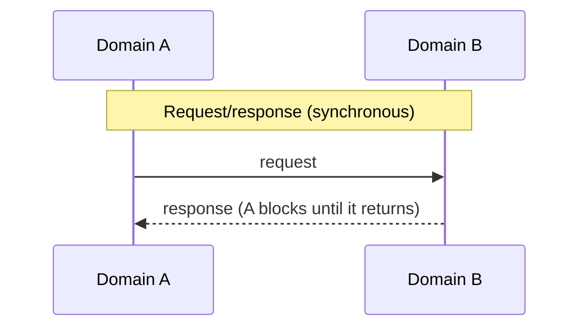
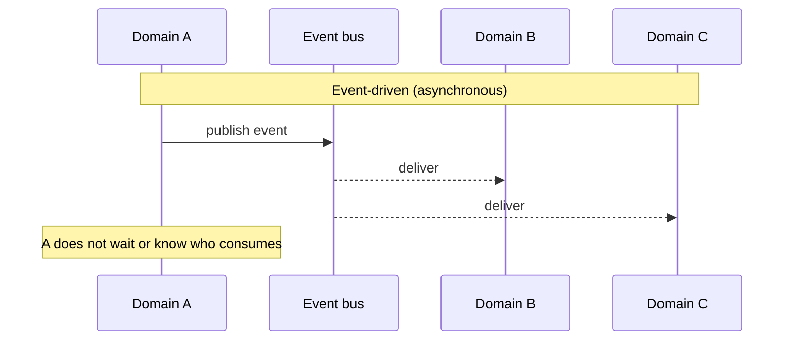

# ADR-005 — Event-driven vs. request/response for cross-domain communication

> Choose by coupling and failure semantics, not fashion. Request/response when the caller genuinely
> can't proceed without an answer. Event-driven when domains should evolve independently and the
> producer shouldn't know — or wait for — its consumers. Async is a liability precisely where you
> need an immediate, consistent answer.

## Context

When one domain needs something from another, the communication style is a coupling decision, not a
transport detail. Request/response couples the caller's availability to the callee's. Event-driven
decouples them in time but trades away the immediate, consistent answer. Picking the wrong one
shows up later as either cascading failures (sync where you needed async) or impossible-to-reason-
about eventual consistency (async where you needed a straight answer).

The physics matter. A synchronous call is not free: an in-datacenter round trip is ~**0.5 ms**, but
a cross-continent round trip is ~**150 ms** (Dean; "Latency Numbers Every Programmer Should Know").
Chain several synchronous calls across domains and those numbers add — and, worse, the whole chain
inherits the **tail latency** of its slowest dependency ("The Tail at Scale," Dean & Barroso): a
service fanning out to many synchronous dependencies is as slow as the slowest one on any given
request, and its p99 degrades fast.

[AUTHOR: the real cross-domain decision, the domains involved, and what the rejected option cost.]

## Options Considered

| Option | Coupling | Failure behavior | Cost / when right |
|--------|----------|------------------|-------------------|
| **Request/response** (REST/gRPC) | Temporal — caller needs callee up *now* | Callee down → caller blocked; risk of cascading failure without timeouts/circuit breakers; tail-latency amplification across a fan-out | Simple to reason about; right when the caller truly cannot proceed without the answer (e.g. authorize this payment). |
| **Event-driven** (pub/sub) | Decoupled — producer doesn't know consumers | Consumer down → events buffer; producer unaffected | Resilience and independent evolution, paid for with eventual consistency, ordering/idempotency burden, and harder tracing/debugging. Right when domains should evolve and fail independently. |

## Decision

[AUTHOR: which you chose, for which interaction.] The rule that should decide it: **does the caller
need the answer to make its next move?** If yes — an authorization, a balance check, a synchronous
validation — use request/response and protect it with timeouts, retries with backoff, and circuit
breakers. If no — a state change other domains merely need to *know about* — publish an event and
let them react on their own schedule.

Most cross-domain communication in a payments platform is the second kind (something happened),
which is why event-driven is the backbone — but the moments that are the first kind (is this
authorized?) must stay synchronous, and getting that boundary wrong is the expensive mistake.

## Consequences

**What it buys (event-driven).** Domains that fail and evolve independently; natural buffering under
load; new consumers added without touching the producer.

**What it costs — and when it's the wrong call.**

- **Eventual consistency and debugging cost.** "Where did this state come from?" spans services and
  time. You take on ordering, idempotency, and distributed tracing as standing obligations.
- **Async is wrong when you need an answer now.** Modeling an authorization as fire-and-forget to
  "decouple" it is how you get a system that can't tell you whether a payment went through.
- **Request/response is wrong** as the default for everything — sync-calling a chain of domains turns
  one slow dependency into a system-wide outage. [AUTHOR: an instance where the coupling choice
  caused, or prevented, a cascading failure.]

## Status

draft — awaiting author specifics and review. The event-driven patterns here are demonstrated in the
**[Payments Resiliency Simulator](https://github.com/raghavarora12/payments-resiliency-simulator)**.
The concrete broker choice for the event-driven path is [ADR-006](006-kafka-for-payment-events.md).
Related principle: [[choose-coupling-on-purpose]].

## References

- Dean & Barroso — [The Tail at Scale](https://research.google/pubs/the-tail-at-scale/), CACM 2013.
- [Latency Numbers Every Programmer Should Know](https://gist.github.com/jboner/2841832).
- Newman — *Building Microservices* (temporal vs. implementation coupling).
