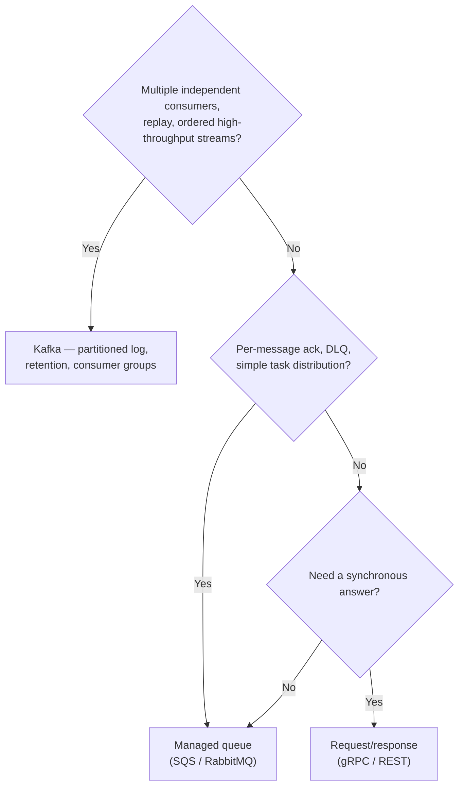

# ADR-006 — Kafka for payment event processing — and where it's the wrong choice

> Kafka is right for a durable, replayable, high-throughput event log with many independent
> consumers — the backbone of a payments event platform. It is a costly mistake used as a simple
> task queue, as a request/reply bus, or by a team too small to carry its operational weight. A log
> is not a queue, and pretending otherwise is where the pain comes from.

## Context

Having chosen event-driven for cross-domain communication ([ADR-005](005-event-driven-vs-request-response.md)),
the next decision is the substrate. Kafka is the default answer for event streaming, but "default"
is not "always right." Kafka is a distributed, partitioned, replayable *log* — that is its power
and also the source of every mistake made with it, because it is repeatedly reached for as if it
were a queue or an RPC channel.

[AUTHOR: the payment-event-processing context, the scale (throughput, consumers, retention) that
justified Kafka.]

## Options Considered

| Use case | Kafka? | Why / better fit |
|----------|--------|------------------|
| Durable, replayable event log; many consumers; high throughput | ✅ Right | Partitioned log, retention, consumer groups, replay — exactly what Kafka is. |
| Simple job/task queue, modest volume | ❌ Wrong | A queue (SQS/RabbitMQ) gives per-message ack and DLQ without partition/consumer-group overhead. |
| Request/reply RPC | ❌ Wrong | You need a synchronous channel — gRPC/REST. Kafka bolted into request/reply is an anti-pattern. |
| Exactly-once financial state transition | ⚠️ Hard | Possible with Kafka transactions + idempotent consumers, or an outbox pattern; naive use double-processes. Design for it explicitly. |
| Low volume, small team | ❌ Wrong | Kafka's operational weight isn't justified; use a managed queue or managed Kafka. |

## Decision

Use Kafka for [AUTHOR: the specific payment event streams], where replay, multiple independent
consumers, ordering within a partition, and high throughput are all genuinely needed. Do **not**
extend it to interactions that are really queues or RPCs just because it's already there —
route those to a queue or a synchronous call respectively.

For financial state transitions, treat exactly-once as a design problem, not a checkbox: partition
by the entity key for ordering, make consumers idempotent, and use transactions or an outbox where
a duplicated event would mean a duplicated payment.

## Consequences

**What it buys.** A durable, replayable backbone: a new consumer can be added and replay history; a
bad consumer can be fixed and reprocess; throughput scales with partitions.

**What it costs — and when it's the wrong call.**

- **Operational weight.** Partitions, consumer-group rebalancing, retention tuning, and broker
  operation are a real standing cost — the reason a small team should reach for a managed queue or
  managed Kafka first.
- **The log-is-not-a-queue tax.** Used as a task queue, you inherit ordering and offset semantics
  you didn't want and lose the per-message ack/DLQ you did.
- **Where Kafka was the wrong choice:** [AUTHOR: the real case — the scar. Where reaching for Kafka
  cost more than it returned, and what you'd use instead.] This is the section that proves this ADR
  is judgment, not advocacy.

## Status

draft — awaiting author specifics and review. Demonstrated in the
**[Payments Resiliency Simulator](https://github.com/raghavarora12/payments-resiliency-simulator)**.
Related: [ADR-005](005-event-driven-vs-request-response.md).
