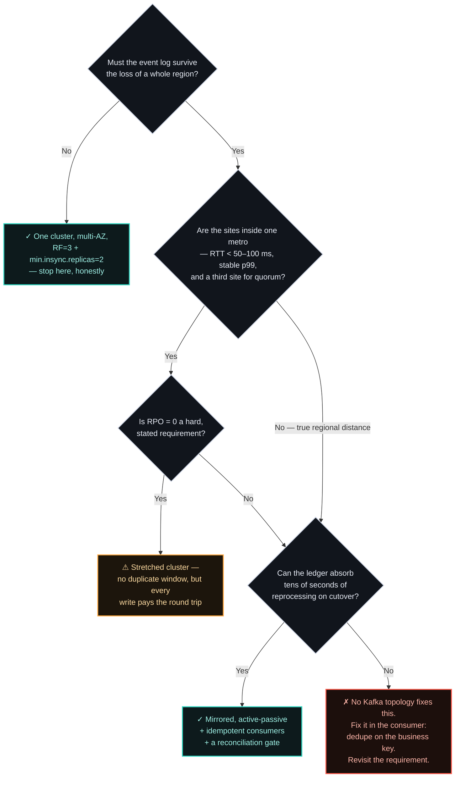

# ADR-006 — Multi-region Kafka: the duplicate window you can't design away

> Cross-cluster replication is at-least-once by construction — Apache says so in its own design
> documents. So the topology you pick doesn't decide whether you reprocess events after a regional
> failover; it only decides **how wide that window is**. Design the consumer and the ledger to close
> it, and buy the topology that makes it narrow enough to afford. Anyone selling you a seamless
> cross-region cutover is selling you the diagram, not the system.

## Context

Uber runs one of the largest Kafka deployments in the world — **trillions of messages and multiple
petabytes of data per day**. Moving those messages between regions was, relatively speaking, the easy
part: they built uReplicator, which "extends the original design of Kafka's MirrorMaker to focus on
extremely high reliability, a zero-data-loss guarantee, and ease of operation."

The hard part was answering a much smaller question: *when a consumer fails over to the other region,
where does it resume?* That question needed its own service. uReplicator "periodically checkpoints the
offset mapping from source to destination," and Uber stores those checkpoints in a separate
active-active database, because the mapping is the only thing that can tell a consumer in region B
what its position in region A meant.

And then there is the line in Uber's write-up that gives this document its shape. Their failover
algorithm **finds the smallest offset among checkpointed values in the passive region "to ensure no
data loss during failover."** Read that again: at the moment of failover, the most sophisticated
multi-region Kafka deployment on the planet deliberately **rewinds**. It chooses duplicates over gaps,
because those are the only two options on offer.

![Diagram: anatomy of a cross-region Kafka failover, drawn on the log itself. The top bar is the source cluster's partition in region A, with three marked positions along it — the last offset-sync checkpoint, the consumer's actual committed position further along, and the head of the log at the end. The band between the checkpoint and the committed position is shaded amber and labelled the duplicate window: records the consumer has already processed but which the checkpoint does not know about, so they will be delivered again. The band between the committed position and the head of the log is shaded red and labelled the loss window: records accepted in region A that asynchronous replication had not yet carried across, which is the RPO. Below, an arrow marks the region failing and the failover. The bottom bar is the target cluster in region B holding the same records at entirely different offset numbers, with the resume point sitting deliberately earlier than the true position, because the translation maps conservatively backwards. The closing caption reads: the window is not a bug, it is the design — the ledger closes it, not the broker.](assets/006-the-duplicate-window.svg)

This is not an Uber-specific compromise. It is what the protocol permits, and Apache states the limits
plainly in its own improvement proposals. **KIP-986 — Cross-Cluster Replication**, still *Under
Discussion*, names the gap in its motivation: replication "does not preserve offsets of individual
records," and "does not preserve exactly-once-semantics for records & consumer offsets."
**KIP-1279 — Cluster Mirroring**, also under discussion, is blunter still: offset mapping is
"**inherently lossy**," and where an exact translation isn't available MirrorMaker 2 "conservatively
maps to earlier records, potentially causing significant duplicate processing during failover
scenarios." It also notes that "transactional metadata for pending transactions does not transfer to
the destination cluster" — which is the sentence that should end any conversation about
exactly-once semantics surviving a regional cutover.

Two open KIPs proposing to fix the same gap is the strongest available evidence that it is not fixed
today — and that offset-faithful, loss-free replication across regions is hard enough that Apache has
not yet settled on how to do it.

Vendors are not lying about this, and it's worth being precise rather than cynical. Confluent's own
description is accurate as far as it goes — "MM2 replicates consumer group offsets, ensuring that
applications consuming from replicated topics maintain their position." That is true. What the
documentation describes is a *mechanism*; what almost nobody writes down is the *consequence* — that
the mechanism has a granularity, that granularity is a window measured in seconds, and everything
inside that window gets processed twice. Lenses' 2025 field analysis puts operational numbers on it:
expect to "lose or reprocess some messages during failover," with gaps of "30–60 seconds worth of
messages" depending on your sync intervals. Worse, with `IdentityReplicationPolicy` — the policy most
disaster-recovery setups choose precisely because it keeps topic names identical across regions —
offset translation "stops working reliably" at all, because the checkpoint topics lack the cluster
prefixes that disambiguate which replication flow they belong to.

[ADR-003](003-multi-region-active-active-vs-active-passive.md) already decided the shape of the data
plane. This ADR exists because that decision does not carry over to the event log, and the reason is
specific: **Kafka's unit of recovery is not a row, it's an offset — and an offset is a coordinate in
one cluster's address space, meaningless in any other.** A database row replicated to region B is the
same row. A message replicated to region B is the same message at a different number, and every
consumer's memory of its own progress is expressed in the numbers that didn't come with it.

Two shapes recur in this decision and pull in different directions. Both are picked up again in the
Decision, once the options are on the table.

### Scenario A: active-active payments

A payments platform moves each transaction through authorization, validation, pricing, and
clearing/settlement. Every stage publishes to Kafka and the next stage consumes from it — a publisher
`P1` writes, a consumer group `C1` reads, and that pattern repeats the whole way down the chain.
Availability requirements put it in two regions, `us-east-1` and `us-west-2`, with both serving live
traffic.

The question to answer: where does an event live, which region may write it, and what happens to a
half-processed transaction when one region disappears mid-chain?

### Scenario B: warm-standby banking events

A banking event backbone persists the log and fans events out to many consumers. It is active in one cloud region, with the second held as warm standby — compute included, not only data.

The question is narrower and much harder to rehearse: when the primary region fails and compute comes up in the standby, where do consumers resume, and what does the business do about the events that were in flight when the lights went out?

## Options Considered

The comparison every vendor publishes ranks these options on RPO and RTO. That table is genuinely
useful and thoroughly covered elsewhere, so it isn't repeated here. The axes that actually drive the
design work downstream are different: **who owns the write**, and **how wide the duplicate window is
when you cut over** — because those two decide how much idempotency and reconciliation machinery you
are obliged to build.

| Option | Who owns the write | Duplicate window on failover | Cost on the write path | What actually breaks |
|--------|--------------------|------------------------------|------------------------|----------------------|
| **Stretched cluster** — brokers span sites, rack-aware, `acks=all` with cross-site `min.insync.replicas` | One cluster, one offset space | **None from offsets** — there is no translation, because there is no second address space | Every acknowledged write pays cross-site round-trip | Quorum, and geography. Cloudera's reference architecture requires **RTT under 50 ms** and notes throughput "degrades rapidly with increasing latency"; Confluent's asks for a **sub-100 ms, very tight p99** network and says outright: do not do this when sites are far apart or latency is "> 100 ms, unstable, or unknown." It also needs a **third site** — two regions cannot form a controller quorum. And it is one blast radius: a poison write lands everywhere at once. |
| **Mirrored active-active** — separate clusters per region, linked by async replication (MM2, MSK Replicator, Cluster Linking); both regions serve traffic | Per-region ownership, or bidirectional | **Seconds** — bounded by the offset-sync interval, and biased backwards on purpose | None; replication is off the write path | Offset translation. Exactly-once does not cross the cluster boundary. Bidirectional flows need cycle prevention. Per KIP-1279, an unclean leader election on the source can leave "divergent state between clusters." |
| **Mirrored active-passive** — the same replication tooling, but only one region serves; the second is a warm standby kept current and idle | One writer, always | **Seconds**, plus cold-start cost | None; replication is off the write path | Everything in the row above, since it is the same mechanism — plus the rehearsal nobody runs. Consumer-group state in the standby is cold, so cutover means a rebalance storm on top of a rewind. |
| **Producer broadcast** — no replication at all; the application itself writes each event to both regions | The producer, N times | **Unbounded and unmeasurable** — there is no shared sequence to reconcile against | N× produce latency and N× failure surface | Everything the other options give you for free. Two independent writes have no atomicity: a partial write leaves the regions permanently divergent with nothing to detect it, and no cross-region ordering exists even when both succeed. |

Two things in that table deserve emphasis, because they are the ones most often missed in design
reviews.

**The stretched cluster's constraint is geographic, not technical.** It is the only option with no
duplicate window, and that makes it seductive for financial workloads. But a sub-50 ms RTT budget
describes *sites within a region or a tight metro* — Confluent's guidance places these architectures
in a single geographic area. It is not a strategy for surviving the loss of a region several thousand
kilometres away; it is a strategy for surviving the loss of a building. Confluent's "2.5 data centre"
variant is the honest expression of this: two full sites plus one light site whose only job is to hold
the controller quorum. If someone proposes a stretched cluster across genuinely distant regions, they
have proposed accepting cross-continent latency on every acknowledged payment write.

**Producer broadcast is not a cheaper mirroring.** It appears in design documents as a way to avoid
operating a replication tool, and it trades a bounded, measurable window for an unbounded, invisible
one. Mirroring can at least tell you its lag. A dual-write that half-succeeded tells you nothing, and
in a payments system "nothing" is the state you can never reconcile out of. Observability narrows this
but does not rescue it: you can alarm on the region that failed to acknowledge, and you still have no
shared sequence to repair against. Detecting divergence and being able to resolve it are different
capabilities, and dual-write gives you only the first.

![Chart: the four multi-region Kafka topologies plotted against each other on two opposing scales. Reading left to right, the width of the duplicate window on failover grows from none, for a stretched cluster, to seconds for both mirrored options — active-passive and active-active, which share the same replication mechanism — to unbounded and unmeasurable for producer dual-write. Running the opposite way, the latency cost paid on every acknowledged write falls from high for the stretched cluster, where each write waits for a cross-site round trip, to none for the mirrored and active-passive options, where replication sits off the write path, and back up for dual-write, which pays N times the produce cost. The stretched cluster is additionally marked as bounded by geography, requiring round-trip times under 50 to 100 milliseconds and a third site for quorum, which confines it to a metro rather than a continent. The caption reads: you are not choosing an availability tier, you are choosing how much reconciliation you will have to build.](assets/006-duplicate-window-spectrum.svg)

The decision aid — and note that it asks a different question from ADR-003's. That one asks what
downtime the business can absorb. This one asks what **reprocessing the ledger** can absorb:

That bottom-right box is the one that matters. If the answer is "no, the ledger cannot absorb
reprocessing," the correct response is never a different replication topology — it is to make
reprocessing harmless.

## Decision

**Default to mirrored active-passive, with idempotent consumers and an explicit reconciliation gate at
cutover.** Treat the duplicate window as a designed, measured, budgeted quantity — a number you
monitor, not a risk you hope doesn't materialise.

What earns a deviation:

- **Stretched cluster** only when all three hold: the sites are inside one metro and meet the latency
  budget, a third site exists to carry the quorum, and RPO = 0 is a stated business requirement rather
  than an engineering preference. It buys away the offset problem and charges for it on every write.
- **Mirrored active-active** only when you are already serving both regions for latency reasons, and
  writes are partitioned by ownership — every entity has a home region that owns its writes. This is
  the same move ADR-003 recommends for the data plane, and it works here for the same reason: it
  removes the conflict rather than resolving it.
- **Producer broadcast: no.** Not as a mirroring substitute. It can be made to *work* only by
  rebuilding outside Kafka the thing Kafka would have given you — a durable store of business keys and
  per-region positions, written on every produce and every consume, and kept correct under partial
  failure. At that point you are operating a second consistency system in order to avoid operating a
  replication tool, at roughly double the produce traffic. If you find yourself designing that store,
  the honest conclusion is that mirroring was the cheaper answer.

Whatever the topology, four things are not optional:

1. **Partition by the entity key.** Ordering is per-partition, and it's the only ordering guarantee you
   will get. Uber's own write-up notes that messages "may become out of order after aggregating from
   the regional clusters" — cross-region aggregation does not preserve a global sequence.
2. **Idempotent producers** (`enable.idempotence=true`), so a retry inside a region doesn't manufacture
   duplicates before the cross-region window even opens. The same setting earns its keep every ordinary
   day, not only on failover day.
3. **Consumers idempotent on the business key** — the payment ID, the instruction reference, the
   correlation ID carried on the event — and never on the offset. The offset is the one identifier
   guaranteed not to survive the trip.
4. **A reconciliation gate on cutover**: before the failed-over consumers are allowed to emit
   externally visible effects, the ledger reconciles the window.

The load-bearing idea: **the broker is not the system of record and cannot certify correctness.** Kafka's
job in a multi-region payments platform is to make the reconciliation window narrow and *known*. Closing
it is the ledger's job.

### Applying this to the two scenarios

#### [Scenario A](#scenario-a-active-active-payments) — active-active payments

> **Verdict: mirrored active-active, with write ownership partitioned per topic.**

The stretched cluster is out immediately: `us-east-1` to `us-west-2` is continental distance, far
outside the sub-50 ms budget, so every acknowledged authorization would pay a cross-country round trip.
Producer broadcast is ruled out by the Decision above. That reduces the choice to the two mirrored
modes, and the scenario settles it — both regions serve live traffic, so both must accept writes.

The shape that works is **topic-level ownership, not cluster-level**: each topic is write-enabled in
exactly one region and mirrored to the other, rather than the whole cluster mirrored symmetrically.
Every entity still has one home for its writes, which is what keeps the conflict from existing at all.

Be honest about what it costs, because this is the part design reviews wave through: topic-level
ownership makes automated disaster recovery *harder*, not easier. Failover is no longer one switch.
Something has to detect the fault in one region and promote write ownership per topic, in order,
without both regions briefly believing they own the same key — and a split-second overlap there is
precisely the two-writer conflict [ADR-003](003-multi-region-active-active-vs-active-passive.md) warns
about. That detection-and-promotion logic is the real project. The mirroring is the easy half.

If the second region turns out not to need writes after all, drop to Scenario B's answer and take the
simpler operation.

#### [Scenario B](#scenario-b-warm-standby-banking-events) — warm-standby banking events

> **Verdict: mirrored active-passive** — one write-active region, the standby kept current and idle,
> with a reconciliation gate on cutover.

This one isn't close. Only one region is write-active at a time, compute fails over alongside the
data, and the RTO is already bounded by how long the standby takes to come up. That start-up window is
wider than the offset-sync interval, which means **the duplicate window is not the binding constraint
here** — a rare and comfortable position, and worth naming rather than over-engineering past.

Mirrored active-active would be the wrong call: paying continuously for bidirectional replication and
conflict avoidance in order to serve a region that is not taking writes. The reconciliation gate,
though, matters more here than anywhere else in this ADR — the rewind lands on consumers that have been
idle, whose group state is cold, and whose operators have realistically never watched them resume
under load.

**Neither verdict is producer dual-write.** In both scenarios events reach the second region by
replication, and every event has exactly one owning region — per topic in Scenario A, for the whole
cluster in Scenario B. That is mirroring. Dual-write would mean the application itself writing each
event to both regions, and neither scenario needs it.

### Decision Drivers

What decides it, in the order the argument usually runs in the room:

- the resiliency and data-availability targets the business has committed to **in writing**, not the
  ones assumed in a design doc;
- the regulatory and compliance obligations, which in payments routinely set the floor before
  engineering gets a vote;
- the budget, remembering the second region is a standing operational cost, not a project cost;
- and whether the organisation can actually *operate* the option — an active-active topology nobody
  can fail over under pressure is worth less than an active-passive one that is rehearsed monthly.

## Consequences

**What it buys.** An event plane that survives the loss of a region with a bounded, measured recovery
— and, more valuable, a consumer estate that treats redelivery as normal rather than exceptional.
Systems built this way ride out ordinary partition rebalances and consumer restarts without incident,
because those produce the same at-least-once behaviour as a regional failover, just more often.

**What it costs.**

- **Publishers** inherit a home-region concept. "Which region owns this entity's writes?" becomes a
  routing decision the application must answer, and answer the same way after a failover as before it.
  In-flight produces at the moment of cutover are the loss window: acknowledged in region A, never
  replicated, and invisible to region B. That is the RPO, and it is a business number, not a broker
  setting.
- **Consumers** carry the real burden. Group state in the standby is cold, so cutover means a rebalance
  on top of a rewind. And when offset translation is unavailable or untrusted — which, with
  `IdentityReplicationPolicy`, is the common case — **resume-by-timestamp is the more honest fallback**
  than a translated offset: it makes the rewind explicit and chosen rather than approximate and hidden.
  Stream processors that keep offsets externally are worse off again; KIP-1279 notes such applications
  must query MM2's internal offset-sync topic themselves to translate, "creating additional complexity
  and potential failure points."
- **Replay** is the capability you bought Kafka for, and the first one that quietly breaks across
  regions. Replay depends on retention, retention is configured per cluster, and almost nobody checks
  that the standby matches. **Your true replay horizon is the shorter of the two regions' retention** —
  and you discover the mismatch on the day you need to reprocess a week of payments in the region that
  keeps three days. This belongs in the failover rehearsal, not the runbook.
- **Reconciliation** stops being an accounting function and becomes an availability control. Its window
  is the sum of three things: replication lag, offset-translation error, and the consumer's own retry
  horizon. Each is measurable; the sum should be an SLO with an owner, and it should be reported the
  same way the availability target in [ADR-002](002-availability-target.md) is reported.
- **Dead-letter handling** is more awkward here than any of the guidance admits, and worth being precise
  about, because the ecosystem only just caught up. Kafka has dead-letter queues for **Connect** (sink
  connectors, via `errors.deadletterqueue.topic.name`, gated on `errors.tolerance=all`) and for
  **Streams**. For plain consumer groups it has been a convention you implement yourself, and
  **KIP-1191 — accepted in July 2026** — is what finally brings a first-class DLQ to share groups, whose
  unprocessable records previously went straight to an archived state with nowhere to inspect them. A
  DLQ is a topic in a cluster, which raises three questions that multi-region guidance does not answer:
  *is the DLQ itself mirrored?* If not, the poison messages die with the region. If it is, they arrive
  in a region whose consumers will rewind and re-derive some of them anyway — so you can be handed the
  same failed payment twice from two directions. And *what closes the loop* — a replayed DLQ entry is
  a new write, in whichever region is now primary.
- **The ordering trap inside the DLQ is the one that actually costs money.** Routing a failed event for
  key X to a dead-letter topic while later events for key X continue to be processed silently destroys
  the per-partition ordering that was the whole reason you partitioned by entity in the first place —
  a reversal applied before the payment it reverses, a debit before the authorisation. For financial
  state transitions the correct pattern is **park the key, not skip the message**: halt progress for
  that entity, let the rest of the partition flow, and reconcile the parked keys deliberately.

**When this is the wrong call.**

- **Multi-region Kafka is wrong when the event plane can be down for a bounded period.** If the ledger
  reconciles the gap anyway — and in a payments platform it does — a second cluster buys a narrower
  window for roughly double the infrastructure plus a permanent operational load: replication lag
  monitoring, offset-sync health, retention parity, and a rehearsal cadence. Single-region with
  multi-AZ, `RF=3` and `min.insync.replicas=2`, is the honest stop for most event streams, exactly as
  ADR-003 argues for the data plane.
- **Stretched clusters across genuinely distant regions are close to always wrong** — the latency is
  charged to every payment, every day, to buy protection against an event that may never occur.
- **And the pattern is wrong when it's adopted without the consumer work.** Mirroring with
  non-idempotent consumers is worse than no mirroring: it converts a regional outage into a silent
  double-processing event, which is the one failure mode a payments platform cannot detect from its
  own dashboards.

## Status

ACCEPTED

Multi-region failover behaviour is demonstrated in the
**[Payments Resiliency Simulator](https://github.com/raghavarora12/payments-resiliency-simulator)**.
The topology decision this one sits underneath is [ADR-003](003-multi-region-active-active-vs-active-passive.md);
the coupling decision that leads to an event log at all is
[ADR-005](005-coupling-across-domains.md). Related principle:
[[design-for-the-common-failure]].

## References

- Uber Engineering — [Disaster recovery for multi-region Kafka](https://www.uber.com/us/en/blog/kafka/) — trillions of messages/day, uReplicator, the offset-mapping checkpoint service, and the failover algorithm that takes the smallest checkpointed offset "to ensure no data loss."
- Apache — [KIP-986: Cross-Cluster Replication](https://cwiki.apache.org/confluence/display/KAFKA/KIP-986:+Cross-Cluster+Replication) (Under Discussion) — replication "does not preserve offsets of individual records" and "does not preserve exactly-once-semantics for records & consumer offsets."
- Apache — [KIP-1279: Cluster Mirroring](https://cwiki.apache.org/confluence/display/KAFKA/KIP-1279:+Cluster+Mirroring) (Under Discussion) — offset mapping is "inherently lossy"; MM2 "conservatively maps to earlier records"; transactional metadata does not transfer across clusters.
- Apache — [KIP-1191: Dead-Letter Queues for Share Groups](https://cwiki.apache.org/confluence/display/KAFKA/KIP-1191:+Dead-Letter+Queues+for+Share+Groups) (Accepted, July 2026) — DLQ existed for Connect and Streams; share groups had no automated handling for unprocessable records until this.
- Lenses.io — [MirrorMaker 2: offset replication vs. translation](https://lenses.io/blog/2025/10/kafka-replication-mirrormaker2-complexity/) (2025) — 30–60 second offset-sync gaps, and translation breaking under `IdentityReplicationPolicy`.
- Cloudera — [Kafka stretch cluster reference architecture](https://docs.cloudera.com/runtime/7.3.1/kafka-planning/topics/kafka-planning-stretch-reference-arch.html) — RTT under 50 ms, three data centres minimum, quorum lost on a second site failure.
- Confluent — [Multi-datacenter architectures](https://docs.confluent.io/platform/current/multi-dc-deployments/multi-region-architectures.html) — sub-100 ms with tight p99s, the 2.5-datacentre quorum pattern, and when not to stretch.
- Confluent — [Kafka Connect error handling and dead letter queues](https://www.confluent.io/blog/kafka-connect-deep-dive-error-handling-dead-letter-queues/) — `errors.deadletterqueue.topic.name` for sink connectors.

---

*The interesting argument here isn't which topology wins — it's how wide a duplicate window your
business can actually absorb, which almost nobody has measured. If you're sizing one up, I'd genuinely
enjoy comparing notes — [get in touch](../README.md#get-in-touch).*
