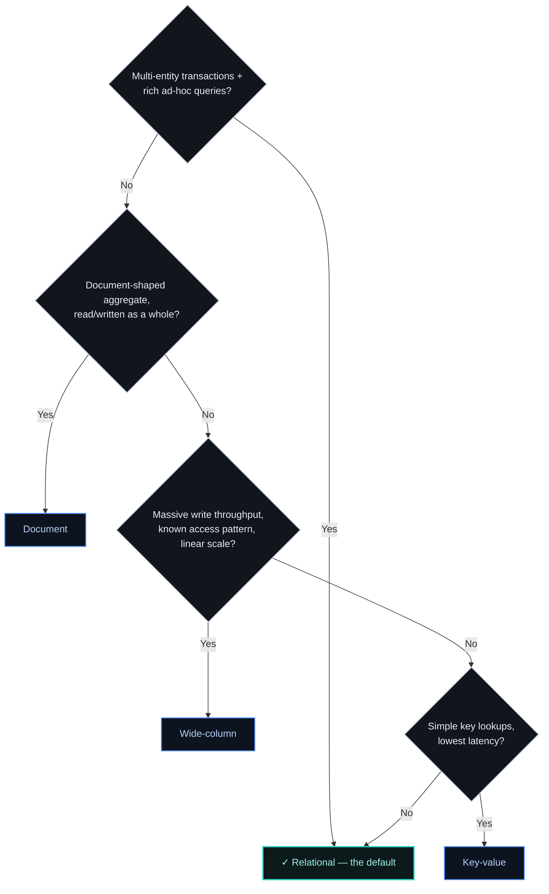

# ADR-007 — Database-selection framework

> A framework, not a ranking. Pick by access pattern, consistency needs, and scale shape — not by
> what's fashionable. Default to relational until a specific pressure forces a move; "NoSQL by
> default" is how you end up re-implementing joins and transactions in application code.

## Context

Two real companies made opposite database decisions in the same decade, and both were right.
Stack Overflow, at the height of the NoSQL era, stayed on a single vertically-scaled SQL Server —
1.5 TB of RAM, roughly 30% of reads served straight from memory — because their access pattern
never demanded anything else; scaling up stayed cheaper than scaling out. Uber, in 2016, moved off
Postgres to MySQL — not for fashion, but because Postgres's write amplification, its expensive
process-per-connection model, and version-locked replication were real, named costs that MySQL's
thread-per-connection model and rolling upgrades removed. Neither company chose by trend. Both
derived the answer from the workload — which is the entire discipline this ADR is trying to
capture.

Database selection is where architecture judgment is most often replaced by habit or hype. The
right output of this decision is not "use X" — it's a repeatable way to reason from a workload to a
data model. This ADR is that framework, so the choice is defensible each time it's made rather than
re-argued from scratch.

Two facts anchor the reasoning. First, the data model must follow the **access pattern**: how the
data is read and written dominates every other criterion (Kleppmann, *DDIA*). Second, physical
placement has real latency consequences — a main-memory reference is ~**100 ns**, an SSD random read
~**16 µs**, a same-datacenter round trip ~**0.5 ms**, cross-continent ~**150 ms** ("Latency Numbers
Every Programmer Should Know"). A datastore that forces an extra network hop or a random-read pattern
your workload can't afford is the wrong datastore, regardless of its label.

[AUTHOR: the real selections this framework is drawn from — a case where relational was kept under
pressure, and a case where a specific pressure justified moving off it.]

## Options Considered

Decide access pattern first; the data model follows from it.

| Family | Data model | Consistency / transactions | Scale shape | Watch out for |
|--------|-----------|----------------------------|-------------|---------------|
| **Relational** | Normalized tables, joins | Strong ACID, multi-row transactions | Vertical + read replicas; sharding is manual | Write-scaling ceiling at very high volume |
| **Document** | Self-contained aggregates | Per-document atomicity; weaker cross-document | Horizontal | Cross-document joins/transactions pushed into app code |
| **Wide-column** | Partitioned wide rows | Tunable, eventual-leaning | Horizontal, linear, write-heavy | Must know your query patterns up front; ad-hoc queries are painful |
| **Key-value** | Opaque value by key | Usually none beyond single key | Horizontal, lowest latency | No querying beyond the key; it's a lookup, not a database of record |

## Decision

Apply the framework in this order, and stop at the first honest answer:

1. **Access pattern** — known and narrow, or ad-hoc and rich? This dominates everything below.
2. **Consistency & transactions** — do you need multi-entity ACID, or is per-record atomicity enough?
3. **Scale shape** — read-heavy, write-heavy, data volume, throughput. Only real pressure here
   justifies leaving relational.
4. **Data-model fit** — relational / document / wide / key-value follows from 1–3, not the reverse.
5. **Operational maturity** — the team's ability to run it is a first-class criterion, not an
   afterthought.

Default to relational and make the workload *earn* a move off it — modern relational engines scale
far further than the "NoSQL for scale" reflex assumes. Polyglot persistence is a cost — every
additional store is operational surface, expertise, and failure modes — so earn each one; do not
collect databases.

## Consequences

**What it buys.** Every database choice becomes a short, defensible derivation from the workload,
consistent across teams — and a future architecture-review agent can check a proposal against these
same criteria.

**What it costs — and when it's the wrong call.**

- **Discipline over reflex.** The framework only works if applied honestly; "we already use X
  everywhere" will masquerade as an access-pattern answer if you let it.
- **Relational-by-default is wrong** when a genuine scale or model pressure exists and the framework
  says so — a global, write-heavy, known-access-pattern workload forced onto a single relational
  primary is its own failure. [AUTHOR: the case where the pressure was real and you moved.]
- **Polyglot is wrong** when the second store is added for a marginal fit gain that doesn't cover its
  operational cost.

## Status

draft — awaiting author specifics and review. This framework is a candidate rule set for the future
architecture-review agent. Related principle: [[match-the-datastore-to-the-access-pattern]].

## References

- Kleppmann — [Designing Data-Intensive Applications](https://dataintensive.net) (access patterns, storage engines).
- [Latency Numbers Every Programmer Should Know](https://gist.github.com/jboner/2841832).
- Nick Craver — [Stack Overflow: The Architecture - 2016 Edition](https://nickcraver.com/blog/2016/02/17/stack-overflow-the-architecture-2016-edition/) — single vertically-scaled SQL Server, 1.5TB RAM, ~30% of reads served from memory.
- Klitzke (Uber Engineering) — [Why Uber Engineering Switched from Postgres to MySQL](https://www.uber.com/en-US/blog/postgres-to-mysql-migration/) (2016) — write amplification, process-per-connection cost, and version-locked replication as the real pressures behind the move.
