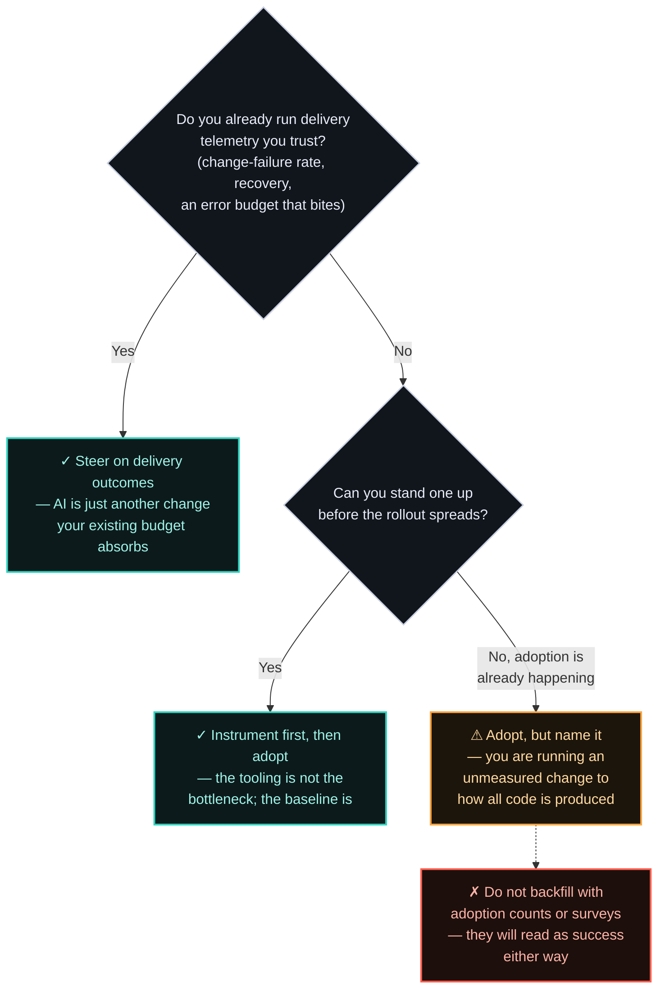

# ADR-008 — [WIP] AI-assisted engineering adoption: a measurement decision, not a tooling one

> ⚠️ **Work in progress.** The argument and its evidence base are drafted, but this ADR is waiting on
> the author's own org specifics — what was rolled out and to whom, what was measured, what was
> deliberately *not* measured, and what that cost. Until those land it is not ready for review, and
> the open `[AUTHOR: …]` markers below are intentional. Every other decision record here is finished;
> this one is not.

> Buying the licences is not the decision. The decision is which number you agree to be judged by
> afterwards — because the tooling raises throughput and instability *together*, amplifies whatever
> discipline you already had, and disqualifies the instrument most organizations actually steer by:
> how fast the work feels. Adoption is not the thing to measure. Adoption is the thing that happens
> to you.

## Context

The adoption question is settled and it was never interesting. DORA's 2025 study of nearly **5,000**
technology professionals found **90%** using AI at work and **more than 80%** believing it had made
them more productive. Nobody is deciding whether to adopt. What remains undecided — and what
actually determines the outcome — is what an engineering organization commits to watching once the
tools are in.

Two findings from that year should shape the answer, and they point at the same weakness.

**The first: throughput and stability moved in opposite directions.** DORA found a positive
relationship between AI adoption and both software delivery throughput and product performance —
and, in the same dataset, a *negative* relationship with software delivery stability. Their framing
is the one worth stealing: "AI doesn't fix a team; it amplifies what's already there. Strong teams
use AI to become even better and more efficient. Struggling teams will find that AI only highlights
and intensifies their existing problems." Or, more bluntly: "AI accelerates software development,
but that acceleration can expose weaknesses downstream."

**The second: the instrument most orgs steer by is the one under suspicion.** METR published a
randomized controlled trial in July 2025, run between February and June that year, on 16 experienced
open-source developers across 246 real tasks in repositories they already knew well. The developers
expected AI to make them **24% faster**. It measured **19% slower**. Afterwards — having just lived
through it — they still estimated they had been **20% faster**. Roughly 39 points between what was
measured and what was felt, by experienced engineers, on their own code.

![Diagram: the perception gap in AI-assisted development. A randomized controlled trial by METR in July 2025 on 16 experienced open-source developers across 246 real tasks found developers predicted AI would make them 24 percent faster, and after completing the work still believed it had made them 20 percent faster, while measurement showed they were 19 percent slower — a gap of roughly 39 points between what was felt and what was measured. In February 2026 METR disclosed selection bias in the study, noting 30 to 50 percent of developers declined to submit tasks they did not want to do without AI, which biases the slowdown estimate downwards; they now describe their data as only very weak evidence for the magnitude. The magnitude is contested; the direction of the misperception is corroborated independently by DORA 2025, where over 80 percent of developers believed AI raised their productivity while delivery stability measurably declined. Conclusion: self-report is not an instrument you can steer an engineering organization by.](assets/008-perception-vs-measurement.svg)

**Now the part most write-ups leave out.** In February 2026 METR published an update disclosing
serious selection bias in that trial: between **30% and 50%** of developers told them they were
declining to submit tasks they didn't want to attempt without AI — which, as METR put it, "likely
biases downwards our estimate of AI-assisted speedup." They now describe their own data as "only
very weak evidence" for the size of the effect, and are redesigning the experiment.

So the headline number is contested, and anyone still quoting "AI makes developers 19% slower" in
2026 is quoting something its own authors have walked back. **The misperception survives the
walkback.** Selection bias attacks the *magnitude* of the slowdown; it does nothing to explain why
engineers who had just been measured reported the opposite of the measurement. And DORA corroborates
the shape independently at a scale of 5,000: more than 80% believed they were more productive, while
delivery stability measurably declined. Two different methods, same divergence between the felt and
the measured.

That is the whole basis for this decision. Not "AI is bad" — it plainly is not, and this repository
was drafted with it. The claim is narrower and more useful: **self-report and adoption counts are
disqualified as steering instruments, so the measurement commitment has to be made deliberately, and
made before the rollout rather than after.**

There is a third finding that belongs here because it is uncomfortable: **30%** of DORA's
respondents report little or no trust in the code AI generates — inside a population where 90% use
it and 80% think it speeds them up. An organization can hold all three of those positions at once.
That is not hypocrisy; it is what an unmeasured process feels like from the inside.

[AUTHOR: the org and its size; what you actually rolled out and to whom; what you chose to measure
and — more interesting — what you refused to measure, and who pushed back.]

## Options Considered

The options are not tools. They are the four things an engineering organization can put on the
dashboard when the tools land, ordered by how easy they are to produce and how badly they mislead:

| What you measure | What it actually tells you | How it fails | When it's right |
|---|---|---|---|
| **Adoption** — seats, % of code AI-written, suggestion-acceptance rate | That the tool is being used. Nothing about whether anything got better. | Goes up regardless of outcome, so it always reads as success. It is the purest possible activity metric — trivial to game, and it becomes a target the moment it reaches a review deck (PRIN-010, *measure outcomes, not activity*). | Rollout logistics only — finding teams that haven't onboarded. Never as a success measure, and never in a board pack. |
| **Developer self-report** — satisfaction, perceived productivity | How the work *feels*, which is genuinely worth knowing — retention lives here. | It is the instrument METR and DORA both caught diverging from measurement. Perceived speed is the one thing you now know AI reliably distorts. | As a secondary signal for experience and friction. Never as the primary evidence that adoption worked. |
| **Delivery outcomes** — change-failure rate, time to restore, throughput, and an error budget that actually bites | Whether the system got faster *without* getting more fragile — the exact tension DORA measured. | Lags by weeks; noisy for small teams; requires telemetry you must already have. It will not give you a clean answer next sprint. | The default, and the only option that can detect the failure mode the research actually found. Builds directly on [ADR-002](002-availability-target.md). |
| **Nothing formal** — ship it and watch | Fast, honest about its own ignorance, costs nothing. | You will still be judged on an outcome; you just won't see it coming, and the amplifier works on dysfunction as readily as on strength. | Genuinely defensible for a small team with no existing telemetry, *if* named as a deliberate bet with a date to revisit — not as a default drifted into. |

## Decision

The tooling choice is not where the leverage is, and treating it as the decision is how organizations
end up with a dashboard that cannot answer the only question that matters. **Commit to delivery
outcomes as the steering instrument — change-failure rate, time to restore, throughput, governed by
an error budget — and commit to them before the rollout, not after.** Keep developer self-report as
a secondary signal about friction and retention. Keep adoption counts for logistics. Neither gets to
declare the rollout a success.

The sharper framing, and the one worth arguing with: **the AI adoption decision is not a new decision
at all — it is a test of whether your delivery discipline was ever real.** If you already run an
error budget with teeth ([ADR-002](002-availability-target.md)), AI is simply another change flowing
through a system built to catch exactly this: throughput rising while stability slips. You do not
need an AI strategy; you need the budget you already have. If you *don't* have one, AI is how you
find out — and the amplifier will find your weakest process before it finds your best engineer.

That is why this sits in the same repository as the availability ADR rather than in a slide deck
about developer productivity. It is the same mechanism, pointed at a new source of change.

[AUTHOR: which of the four you actually committed to, for which org, and what the rollout looked
like once that commitment was public.]

## Consequences

**What it buys.** The ability to detect the failure mode the research actually found — acceleration
that quietly buys instability — while it is still cheap to correct. And a defensible answer to "is
the AI investment working?" that does not depend on asking people how they feel about it.

**What it costs — and when it's the wrong call.**

- **You fly partially blind for a quarter.** Outcome metrics lag. Adoption dashboards are available
  next week and yours won't be, and you will be asked for them by people who have seen a vendor's.
  Committing to the slower instrument means spending political capital defending an empty chart.
- **You give up the easy narrative.** An adoption percentage makes a great slide; a change-failure
  rate that held flat through the rollout is a better fact and a worse slide. Whoever presents the
  second one pays for it in the room. [AUTHOR: the actual numbers you put in front of leadership,
  and whether that cost landed on you.]
- **The four keys are noisy at small scale.** For a team of six, change-failure rate is a handful of
  events a quarter and the signal is genuinely weak. Applying this ADR to a small team is
  measurement theatre with extra steps; there, "nothing formal, revisit in two quarters" is the
  honest option.
- **The evidence base is contested and dating fast.** This ADR leans on two 2025 studies, and one of
  them has already been partly retracted by its own authors. If you are reading this well after
  mid-2026, re-check both before quoting either — the direction of the argument has held so far, the
  numbers should not be assumed to. Treat that as the ADR's own error budget.
- **When this is simply wrong:** an organization with no delivery telemetry, in a competitive
  window, where standing up measurement first would delay adoption by two quarters. The amplifier
  argument cuts both ways — a strong team without dashboards may well be better off adopting and
  instrumenting in parallel. The failure to avoid is not "adopting unmeasured," it is adopting
  unmeasured *and telling yourself the adoption numbers mean something.*

## Status

draft — awaiting author specifics and review. Added to scope after the initial seven-ADR shortlist
(SPEC §3.2 and PLAN §3.4 updated to match); it earns its place on lived org-adoption experience, not
on the topic being current. Builds directly on [ADR-002](002-availability-target.md) — the error
budget is the mechanism this ADR relies on to catch the instability DORA measured. Its counterpart is
[ADR-005](005-coupling-across-domains.md): this ADR decides how AI adoption is *measured*, that one
decides how agents are *wired* — the organizational and architectural halves of the same arrival.
Distils into
[[measure-outcomes-not-activity]] (PRIN-010) and
tests [[make-novelty-earn-its-place]] (PRIN-007)
against the least-boring technology of the decade.

## References

- DORA — [State of AI-assisted Software Development](https://dora.dev/dora-report-2025/) (23 September 2025; ~5,000 respondents, 100+ hours of qualitative data) — 90% AI adoption, >80% perceiving productivity gains, 30% reporting little or no trust in AI-generated code; a positive relationship with throughput and product performance alongside a **negative** relationship with delivery stability; and the amplifier framing: "AI doesn't fix a team; it amplifies what's already there."
- METR — [Measuring the Impact of Early-2025 AI on Experienced Open-Source Developer Productivity](https://metr.org/blog/2025-07-10-early-2025-ai-experienced-os-dev-study/) (10 July 2025) — the RCT: 16 developers, 246 tasks, 24% predicted speedup, 20% perceived speedup, 19% measured slowdown. Tooling was Cursor Pro with Claude 3.5/3.7 Sonnet, February–June 2025.
- METR — [We are changing our developer productivity experiment design](https://metr.org/blog/2026-02-24-uplift-update/) (24 February 2026) — **read this alongside the study above, not instead of it.** Discloses selection bias (30–50% of developers declining to submit tasks they didn't want to do without AI), which "likely biases downwards our estimate of AI-assisted speedup"; the authors now call their data "only very weak evidence" for the magnitude.
- [ADR-002](002-availability-target.md) — the error-budget mechanism this ADR steers with, and the 2025 DORA change-failure-rate bands it references.

---

*The interesting argument here isn't whether to use AI — it's what you agree to be measured on
afterwards, and how much political capital that costs. If you've made that call in a real org, I'd
genuinely enjoy comparing notes — [get in touch](../README.md#get-in-touch).*
