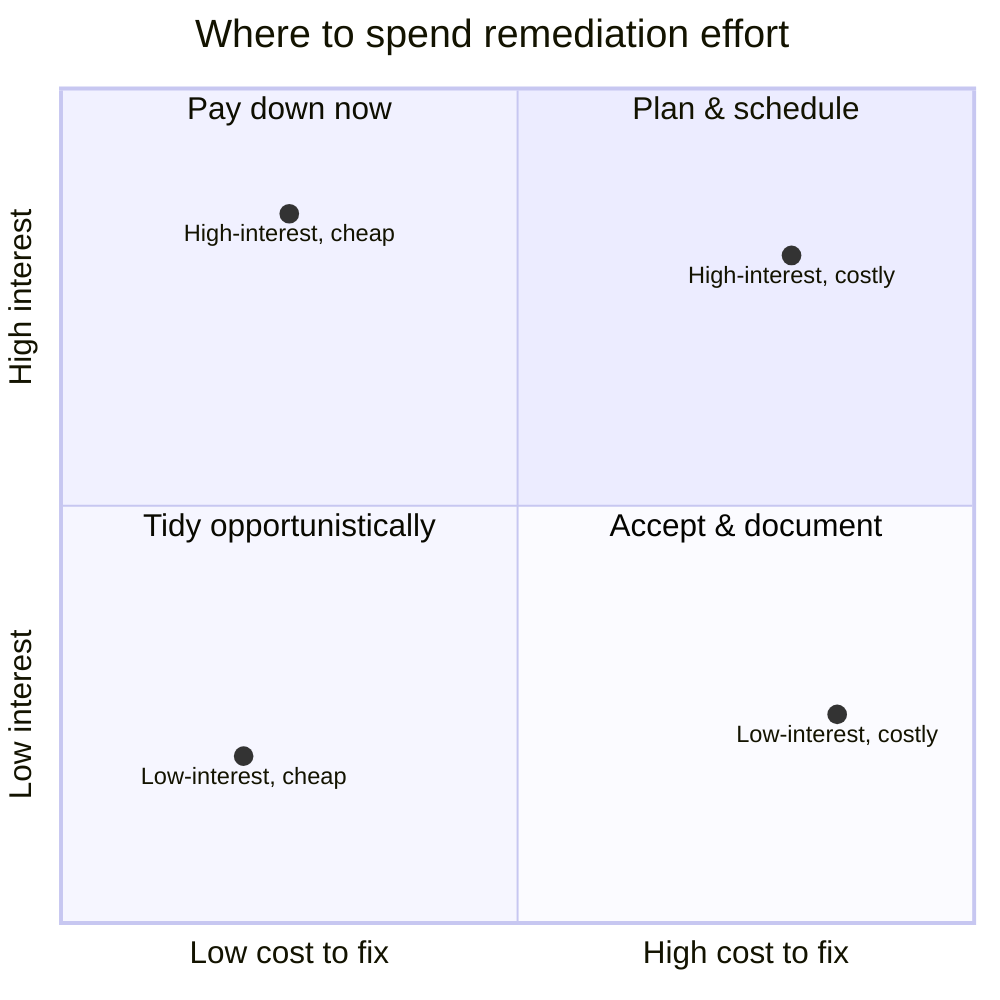

# Tech-Debt Classification & Prioritization Framework

Not all tech debt should be paid down. The job is not a clean codebase; it's spending remediation
effort where the *interest* hurts most. This framework classifies debt honestly, then prioritizes
it by the only two things that matter: how fast it compounds, and what it costs to fix.

## 1. Classify — what kind of debt is this?

Borrowed from Fowler's quadrant. The point is honesty about *how* the debt was taken on, because
reckless debt is a process problem, not just a code problem.

| | **Prudent** | **Reckless** |
|---|---|---|
| **Deliberate** | "We'll ship the simple version now and revisit." — Fine, *if* it's tracked. | "We don't have time for design." — The dangerous one; it's a habit, not a decision. |
| **Inadvertent** | "Now we understand the domain, the old model is wrong." — Unavoidable and healthy. | "What's layering?" — A capability gap; fix the team, not just the code. |

Deliberate-prudent debt is a tool. Reckless debt — of either kind — is the signal to change how
decisions get made, not just to schedule a cleanup.

## 2. Prioritize — interest rate, not size

Prioritize on two axes:

- **Interest rate** — how fast this debt compounds: how often it slows a change, causes a bug, or
  blocks a team. High-interest debt taxes you every sprint; low-interest debt just sits there.
- **Cost to fix** — the effort and risk to remediate.

Blast radius (how many teams/systems the debt touches) is a multiplier on interest rate.

- **Pay down now** (high interest, low cost) — the obvious ROI; do these continuously.
- **Plan & schedule** (high interest, high cost) — real projects; fund them explicitly, don't
  pretend they'll happen "in the cracks."
- **Tidy opportunistically** (low interest, low cost) — fix while you're in the file; never a
  dedicated project.
- **Accept & document** (low interest, high cost) — write down that you're choosing to live with
  it, so it isn't rediscovered as a surprise. Deliberately holding low-interest debt is a valid,
  senior decision.

## 3. Track — the debt register

One row per item. Keep it visible and reviewed; untracked debt is reckless debt by default.

| Item | Type (from §1) | Interest rate (H/M/L) | Blast radius | Cost to fix (H/M/L) | Decision (pay now / schedule / tidy / accept) | Owner |
|------|----------------|-----------------------|--------------|---------------------|-----------------------------------------------|-------|
| *(one row per item)* | | | | | | |

**The discipline:** review the register on a cadence, pay down high-interest debt continuously, and
make "accept & document" an explicit, owned decision — never a silent one.
